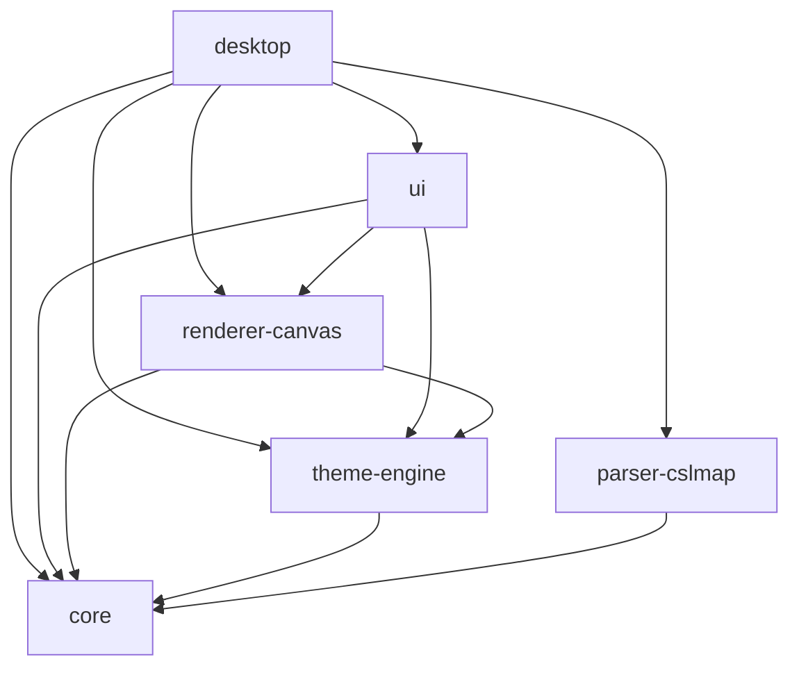

# Vellum

Visor de escritorio para archivos **CSLMap** — exportaciones de mapas de Cities: Skylines.

Aplicación nativa multiplataforma construida con Tauri 2 (Rust) + React 19 + TypeScript, organizada como monorepo con pnpm workspaces y Turborepo.

> Estado actual: **scaffolding funcional** — monorepo, dev y build desktop validados en Windows y macOS.

---

## Stack Tecnológico

| Capa | Tecnología | Versión |
|------|-----------|---------|
| Shell de escritorio | Tauri + Rust | 2.x / Edition 2021 |
| UI | React | ^19.1.0 |
| Lenguaje | TypeScript | ~5.8.3 |
| Build / Dev server | Vite | ^7.0.4 |
| Orquestador de build | Turborepo | latest |
| Gestor de paquetes | pnpm | 10.33.0 |

---

## Arquitectura del Monorepo

```
vellum/
├── apps/
│   └── desktop/            ← App principal (Tauri shell + Vite/React)
└── packages/
    ├── core/               ← Tipos y lógica base del dominio
    ├── parser-cslmap/      ← Parser del formato CSLMap
    ├── renderer-canvas/    ← Renderizador Canvas 2D
    ├── theme-engine/       ← Motor de temas y design tokens
    └── ui/                 ← Componentes React reutilizables
```

### Grafo de dependencias



`@vellum/core` es la dependencia base de todos los paquetes.

---

## Flujo de datos

```
Archivo .cslmap (disco)
        │
        ▼
 parser-cslmap          → Documento tipado (@vellum/core)
                                  │
                                  ▼
                    renderer-canvas + theme-engine
                                  │
                                  ▼
                           Canvas 2D / SVG
                                  │
                                  ▼
                            @vellum/ui (React)
                                  │
                                  ▼
                        apps/desktop (ventana Tauri)
```

---

## Requisitos Previos

| Herramienta | Versión | Verificar |
|-------------|---------|-----------|
| Node.js | LTS ≥ 18 | `node --version` |
| pnpm | 10.33.0 | `pnpm --version` |
| Rust | stable (Edition 2021) | `rustc --version` |
| Tauri CLI | ^2.x | `pnpm tauri --version` |

> Tauri 2 requiere dependencias del sistema operativo para compilar el shell nativo. Consulta la [documentación oficial de Tauri](https://tauri.app/start/prerequisites/) para tu plataforma.

---

## Instalación

```bash
git clone <repo-url>
cd Vellum
pnpm install
```

`pnpm install` instala dependencias de todos los workspaces y crea los symlinks entre paquetes internos.

### Paso adicional en macOS con pnpm 10

Si `pnpm install` muestra un aviso como `Ignored build scripts: esbuild`, aprueba ese build script antes de continuar:

```bash
pnpm approve-builds
pnpm install
```

Esto es necesario para que `vite` y `esbuild` funcionen correctamente en `pnpm dev` y `pnpm build`.

---

## Comandos Principales

| Comando | Descripción |
|---------|-------------|
| `pnpm dev` | Inicia la app en modo desarrollo (Vite + Tauri con hot-reload) |
| `pnpm build` | Compila todo el monorepo en orden topológico |
| `pnpm lint` | Verifica tipos TypeScript en todos los paquetes (`tsc --noEmit`) |
| `pnpm check:architecture` | Verifica reglas de Clean Architecture e imports entre packages |
| `pnpm test` | Ejecuta pruebas *(framework aún no configurado)* |

### Solo frontend (sin proceso Tauri)

```bash
cd apps/desktop
pnpm dev:vite
```

### Verificación de arquitectura

La story 1-2 deja dos barreras activas para proteger el grafo del monorepo:

- `packages/core` sobreescribe `compilerOptions.paths` con `{}` para no heredar aliases a otros `@vellum/*`.
- `eslint.config.mjs` bloquea imports a subpaths internos como `@vellum/core/src/...` o `../../core/src/...`.

Usa este comando antes de cerrar una story que toque dependencias entre packages:

```bash
pnpm check:architecture
```

Reglas rápidas:

- Importa otros packages solo desde su barrel público: `@vellum/core`, `@vellum/ui`, etc.
- No importes desde `src/`, `dist/` ni por rutas relativas que crucen packages.
- `@vellum/core` no debe depender de ningún otro package del monorepo.

---

## Ejecución por Plataforma

### macOS

1. Instala los prerrequisitos de Tauri para macOS y Rust estable.
2. Ejecuta `pnpm install`.
3. Si pnpm bloquea scripts de build, corre `pnpm approve-builds` y aprueba `esbuild`.
4. Inicia desarrollo con `pnpm dev`.
5. Genera el bundle instalable con `pnpm build`.

Resultado esperado:
- `pnpm dev` abre la ventana de Vellum.
- `pnpm build` genera la app instalable `.app` / bundle para arrastrar a `Applications`.

### Windows

1. Instala Node.js, pnpm 10.33.0 y Rust estable.
2. Instala los prerrequisitos de Tauri para Windows (MSVC build tools / WebView2 si aplica).
3. Ejecuta `pnpm install`.
4. Inicia desarrollo con `pnpm dev`.
5. Genera instaladores con `pnpm build`.

Resultado esperado:
- `pnpm dev` abre la ventana de Vellum.
- `pnpm build` produce instaladores como `.msi` y `-setup.exe`.

### Solución rápida de problemas

- Si aparece `TS6305`, limpia artefactos locales y vuelve a compilar:

```bash
rm -rf .turbo apps/desktop/dist packages/*/dist
find . -name "tsconfig.tsbuildinfo" -delete
pnpm build
```

- Si `pnpm install` bloquea `esbuild`, ejecuta `pnpm approve-builds`.

---

## Documentación

La documentación técnica generada se encuentra en [`docs/`](docs/):

| Documento | Descripción |
|-----------|-------------|
| [project-overview.md](docs/project-overview.md) | Visión general, stack y estructura |
| [development-guide.md](docs/development-guide.md) | Setup, comandos y guías de desarrollo |
| [integration-architecture.md](docs/integration-architecture.md) | Grafo de integración y comunicación Tauri IPC |
| [architecture-desktop.md](docs/architecture-desktop.md) | Arquitectura interna de la app desktop |
| [source-tree-analysis.md](docs/source-tree-analysis.md) | Árbol de fuentes anotado |
| [component-inventory-desktop.md](docs/component-inventory-desktop.md) | Inventario de componentes React |
| [index.md](docs/index.md) | Índice completo de documentación |

Los artefactos de planificación (PRD, arquitectura, épicas, UX) están en [`_bmad-output/planning-artifacts/`](_bmad-output/planning-artifacts/).
