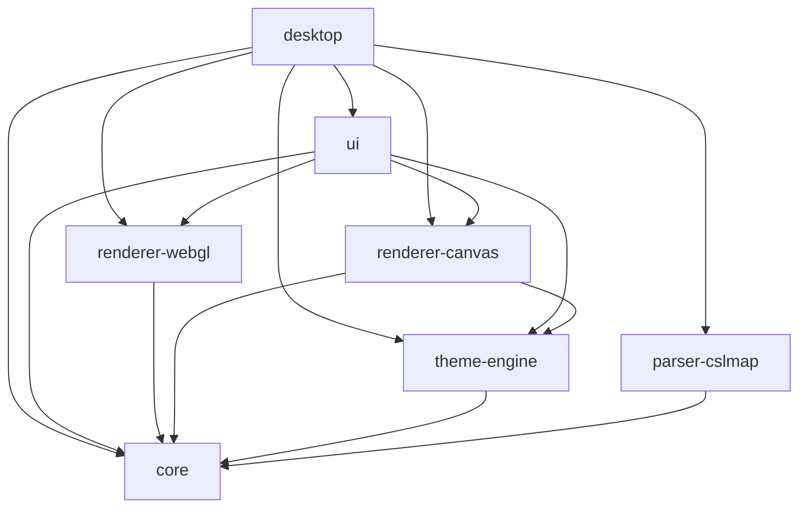

# Vellum

**Desktop viewer for Cities: Skylines `.cslmap` files.** Drag in a map export and explore it with smooth WebGL rendering, layer controls, and keyboard navigation.

Built with Tauri 2 (Rust) + React 19 + TypeScript, organized as a pnpm + Turborepo monorepo.

---

## For Users

### Features

- **Open `.cslmap` files** — drag & drop or use `Ctrl+O` / `Cmd+O`
- **7 map layers** — toggle terrain, water, roads, transit, buildings, forests, and districts on/off
- **Smooth WebGL rendering** — GPU-accelerated via MapLibre GL JS, 30+ fps pan/zoom
- **Transit explorer** — inspect bus, metro, train, tram, and other transit line routes
- **Map tooltips** — hover transit stops to see which lines serve them
- **Minimap** — orient yourself with a small overview in the corner
- **Keyboard shortcuts** — `1-7` toggle layers, `+/-` zoom, `Tab` clean mode, `H` hide panel
- **Clean mode** — `Tab` hides all UI chrome for an unobstructed map view
- **Dual language** — English and Spanish UI
- **Partial loading** — opens damaged or DLC-heavy maps with graceful fallback

### Requirements

| Tool      | Version               | Check                  |
| --------- | --------------------- | ---------------------- |
| Node.js   | LTS ≥ 18              | `node --version`       |
| pnpm      | 10.33.0               | `pnpm --version`       |
| Rust      | stable (edition 2021) | `rustc --version`      |
| Tauri CLI | ^2.x                  | `pnpm tauri --version` |

> Tauri 2 requires platform-specific build dependencies. See [Tauri prerequisites](https://tauri.app/start/prerequisites/).

### Quick Start

```bash
git clone <repo-url>
cd vellum
pnpm install          # or pnpm approve-builds && pnpm install if esbuild is blocked
pnpm dev              # opens the native window
```

### Status

| Epic | Area                    | Status      |
| ---- | ----------------------- | ----------- |
| 1    | Project foundation      | ✅ Complete |
| 2    | File loading & parser   | ✅ Complete |
| 3    | Cartographic rendering  | ✅ Complete |
| 4    | Exploration & UI        | ✅ Complete |
| 5    | Theme system            | 🔜 Planned  |
| 6    | PNG/SVG export          | 🔜 Planned  |
| 7    | i18n, settings, updates | 🔜 Planned  |

---

## For Developers

### Architecture

The project follows Clean Architecture with strict unidirectional dependencies. Every `@vellum/*` package is a self-contained module with a single responsibility.

```
vellum/
├── apps/
│   └── desktop/                ← Tauri shell + Vite/React (Composition Root)
│       ├── src/                ← React entry: main.tsx, hooks
│       └── src-tauri/          ← Rust backend: IPC commands, Tauri plugins
├── packages/
│   ├── core/                   ← Domain types, IPC contract, interfaces
│   ├── parser-cslmap/          ← Rust + TS adapter: .cslmap XML → CityData
│   ├── renderer-webgl/         ← MapLibre GL JS renderer (active)
│   ├── renderer-canvas/        ← Canvas 2D renderer (legacy — superseded by WebGL)
│   ├── theme-engine/           ← .vellumstyle → RenderStyleParams (in progress)
│   └── ui/                     ← React components, Zustand store, i18n
├── docs/                       ← Documentation
├── _bmad-output/               ← Planning artifacts
└── _bmad/                      ← Workflow configuration
```

### Dependency Graph



`@vellum/core` has zero internal dependencies — it is the pure entity layer. `desktop` is the only Composition Root and may import any package.

### Data Flow

```
.cslmap file (disk)
       │
       ▼
 parser-cslmap (Rust via Tauri IPC)
       │
       ▼
 CityData (immutable domain model — @vellum/core)
       │
       ▼
 MapLibreRenderer (WebGL via MapLibre GL JS — @vellum/renderer-webgl)
       │
       ▼
 MapLibreRoot (React — @vellum/ui)
       │
       ▼
 Tauri native window (apps/desktop)
```

### Key Stack

| Layer              | Technology                            |
| ------------------ | ------------------------------------- |
| Desktop shell      | Tauri 2 + Rust                        |
| UI                 | React 19 + TypeScript                 |
| Rendering          | MapLibre GL JS (WebGL)                |
| Build / Dev server | Vite 7                                |
| Orchestrator       | Turborepo                             |
| Package manager    | pnpm 10.33.0                          |
| XML parser         | quick-xml 0.36 (Rust)                 |
| State              | Zustand 5                             |
| i18n               | react-i18next + i18next               |
| Styling            | Tailwind CSS 4 + shadcn/ui (Radix)    |
| Testing (TS)       | Vitest                                |
| Testing (Rust)     | cargo test                            |
| Testing (E2E)      | Playwright (configured, no tests yet) |

### Commands

| Command                    | Description                                                |
| -------------------------- | ---------------------------------------------------------- |
| `pnpm dev`                 | Start dev mode (Vite + Tauri, hot-reload)                  |
| `pnpm build`               | Build all packages in topological order                    |
| `pnpm lint`                | TypeScript type-check (`tsc --noEmit`) across all packages |
| `pnpm check:architecture`  | Enforce cross-package import rules                         |
| `pnpm test`                | Run all tests (Vitest + cargo test)                        |
| `pnpm format`              | Prettier --write                                           |
| `cargo clippy --workspace` | Rust linter                                                |
| `pnpm --filter <pkg> test` | Test a single package                                      |

#### Frontend-only (no Tauri process)

```bash
cd apps/desktop && pnpm dev:vite
```

#### Clean stale build artifacts

```bash
rm -rf .turbo apps/desktop/dist packages/*/dist
find . -name "tsconfig.tsbuildinfo" -delete && pnpm build
```

### Architecture Rules

- **Barrel imports only** — always `import { X } from '@vellum/core'`, never `from '@vellum/core/src/...'`
- **No `any`** — `@typescript-eslint/no-explicit-any: error`. Use `unknown` + type guards.
- **`unwrap()` / `expect()` prohibited** in Rust production code — all errors are `Result<T, VellumError>`
- **`LandArray` and `WaterArray`** are separate structures — never merge them into a single heightmap
- **`Bus Line` segments** are virtual connectors — never render as road geometry
- **Road widths** always expose `fixed + scaled` components, never a single pre-calculated value
- **`VellumError.reason`** is for logging only — map `type` to i18n keys in the UI, never display the raw string

### Testing

- **Vitest** configured at root via `vitest.workspace.ts` — ~20 test files across packages
- **Rust tests** via `cargo test --workspace` — parser unit tests with real `.cslmap` fixtures
- **E2E** Playwright configured in `apps/desktop` but no tests written yet
- Real `.cslmap` test files live in `packages/parser-cslmap/fixtures/`

### CI/CD

| Workflow                                     | Trigger           | Purpose                                     |
| -------------------------------------------- | ----------------- | ------------------------------------------- |
| [ci.yml](.github/workflows/ci.yml)           | Push/PR to `main` | Build, test (Rust + TS), lint (TS + Clippy) |
| [release.yml](.github/workflows/release.yml) | Tag `v*`          | Multi-platform build + GitHub Release draft |

### Docs

Additional documentation in [`docs/`](docs/):

- [Project Overview](docs/project-overview.md)
- [Development Guide](docs/development-guide.md)
- [Integration Architecture](docs/integration-architecture.md)
- [Architecture — Desktop](docs/architecture-desktop.md)
- [Source Tree Analysis](docs/source-tree-analysis.md)
- [Component Inventory](docs/component-inventory-desktop.md)
- [README (Español)](docs/README.es.md)
