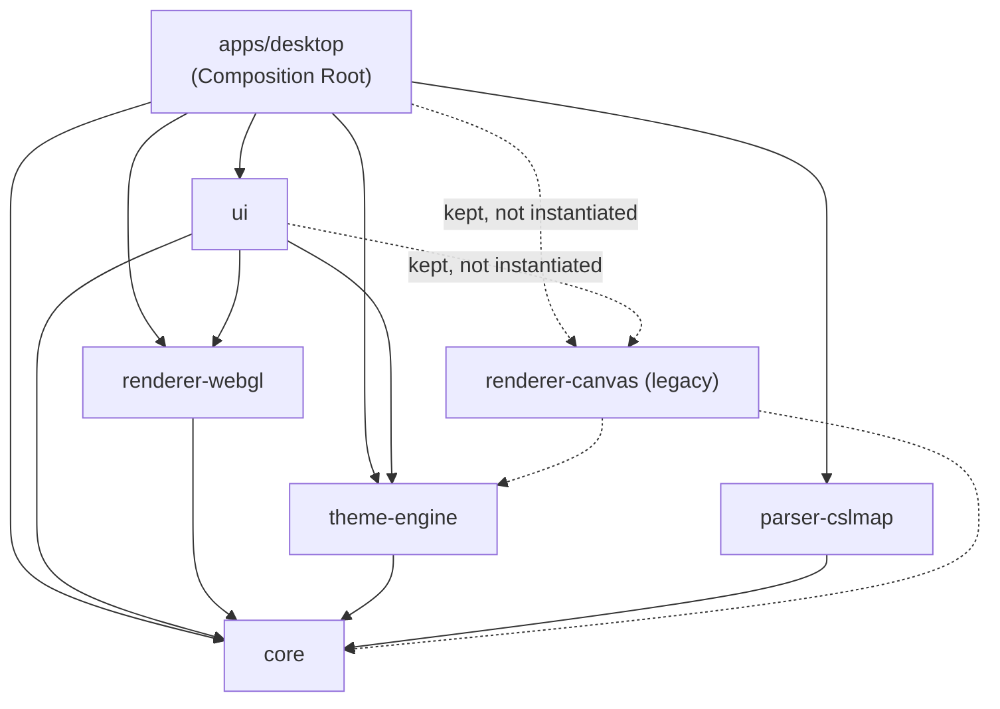
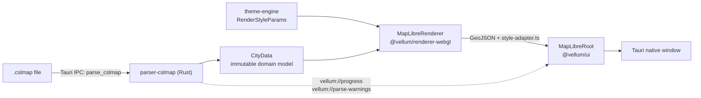

# Vellum

**A native desktop app that renders Cities: Skylines `.cslmap` exports as a GPU-accelerated vector map.** Drop in a save export, pan and zoom a whole city at 30+ fps, toggle terrain/roads/transit/buildings independently.

<!-- GIF, immediately here, first visual in the document: drag a .cslmap onto the window → progress bar → map reveals. This is the single highest-leverage asset in the whole README and doesn't exist yet. -->

[](https://github.com/sebas-tcotd/vellum/actions/workflows/pr-validation.yml)
&nbsp;·&nbsp;[Español](docs/README.es.md)

---

## What is Vellum

A city you spent forty hours building in Cities: Skylines exists, outside the game, as a screenshot. Vellum reads the actual `.cslmap` export — the same proprietary XML the game itself writes — and renders it as a real, interactive vector map: pan, zoom, toggle layers, inspect a transit line stop by stop. Not a picture of the city. The city.

## The Problem

Cities: Skylines has no first-party way to view a saved city outside the game itself — the only built-in export is a screen-resolution screenshot. This isn't a niche game either: SteamDB counted 12,175 active players the month this project's brief was written (March 2026). What the community has instead is four tools, each broken in a different way: **CSL Map View**, the original, was pulled from the Steam Workshop and never got a successor. **CSL-QMapViewer** works but renders at a quality that doesn't do a city justice. **cslweb** has broken road rendering. **cslmap_converter** exports to GeoJSON, which means QGIS — professional GIS software — just to look at your own city. None of them treat the map as anything more than a data dump; they re-derive road hierarchy and transit routing from scratch instead of reading what the game engine already computed, which is where the rendering bugs creep in — a road misclassified because a viewer guessed from its name instead of its `ItemClass`, a transit line redrawn instead of read from the game's own pre-calculated path.

Vellum's bet is that visual quality is the product, not a finish applied at the end — a city map should look like it belongs next to a London Underground diagram or an IGN topographic sheet, not like debug output.

It's a desktop app and not a web tool for the same reason: `.cslmap` exports run 10–50MB, GPU-accelerated rendering needs to actually touch the GPU rather than fight a browser sandbox for it, and nobody should have to upload a save file to a server to look at their own city.

The test fixtures in this repo aren't all synthetic, either. Alongside two curated cities (`altavento`, `aurelia-del-delta`), the fixtures directory has raw, timestamped exports from real development sessions — one of them named `Verkehrsbehebung` ("traffic fix"), committed the same day as a transit-rendering bug fix. This wasn't built against toy data; it was debugged against actual cities.

## Features

- **Open `.cslmap` files** — drag & drop or `Ctrl+O` / `Cmd+O`
- **7 independent map layers** — terrain, water, roads, transit, buildings, forests, districts
- **GPU-accelerated rendering** — MapLibre GL JS, 30+ fps pan/zoom
- **Transit explorer** — bus, metro, train, tram, monorail, cable car, ferry, and blimp routes, with hover tooltips showing which lines serve a stop
- **Minimap** for orientation on large maps
- **Clean mode** (`Tab`) strips all UI chrome down to the map itself
- **English / Spanish UI**
- **Partial loading** — a damaged file or an unrecognized DLC asset degrades to a fallback instead of failing the whole load

<!-- Static screenshot here: main view, all 7 layers on, using one of the real fixture cities (Pepper Lake or Island Hopping — both large enough to look like an actual city, not a test map). -->

## Try it

```bash
pnpm dev
```

Then drag either fixture in [`packages/parser-cslmap/fixtures`](packages/parser-cslmap/fixtures) (`altavento.cslmap`, `aurelia-del-delta.cslmap`) onto the window — no CS1 install or your own save required. Once it's loaded: `1`–`7` toggles a layer, `+`/`-` zooms, `Tab` clears the UI, `H` hides just the layer panel.

<!-- Static screenshot here: layer panel mid-interaction + a transit tooltip visible on hover. -->
<!-- Static screenshot here: clean mode vs. normal mode, side by side. -->

## Architecture

Midway through the project, the rendering engine changed from Canvas 2D (a Web Worker painting to an `OffscreenCanvas`) to WebGL (MapLibre GL JS). It wasn't a planned rewrite — Canvas hit a hard ceiling: panning required an ever-larger CPU-rendered overscan buffer to hide the edges, and that buffer's cost grows quadratically. Two separate specs and several iterations couldn't fix it, because it wasn't a bug; it was `overscan + CPU`, a combination that doesn't scale no matter how it's implemented. The project's own retrospective for that period is unusually candid about it — it doesn't call this a clean technical decision, it describes a real process of resistance before the pivot. What actually settled it was a spike, committed as [`0cc3e99`](https://github.com/sebas-tcotd/vellum/commit/0cc3e99), that proved MapLibre could hit the target frame rate before any commitment was made to rewrite the renderer around it.

The pivot cost far less than it should have, because rendering was never called directly — every renderer implements the same `IRenderer` port defined in `packages/core/src/types/renderer.ts`, and `packages/ui` only ever depends on that interface. Swapping the implementation meant changing one import in `App.tsx`; the IPC contract, the domain model, and the Zustand store didn't move. The old implementation (`renderer-canvas`) is still in the tree, still fully tested, still bound by the same import rules — kept deliberately. The plan is to eventually document it as a starting point for anyone who wants to take a run at solving Canvas's performance ceiling; that note doesn't exist yet, this paragraph is the closest thing to it right now. The dotted lines below are that boundary made visible:



The graph isn't just documentation — `pnpm check:architecture` runs a custom ESLint `no-restricted-imports` rule in CI that fails the build if a package reaches across a boundary this diagram doesn't show. `@vellum/core` depends on nothing: it's the pure entity layer (domain types + the IPC contract), and every other package's job is defined relative to it. `apps/desktop` is the only package allowed to import everything else — one composition root, not implicit wiring scattered across the tree.



## Implementation

The section above is what the system looks like. This is what it's actually made of — useful if you're evaluating the engineering, not required if you're just here to use the app.

### IPC contract

`packages/core/src/ipc-contract.ts` defines every command, event, and error type that crosses the Rust↔TypeScript boundary — this is the actual type, not a paraphrase:

```typescript
export const IPC_COMMANDS = {
  PARSE_CSLMAP: 'parse_cslmap',
  EXPORT_PNG: 'export_png',
  EXPORT_SVG: 'export_svg',
} as const;

export type VellumError =
  | { type: 'InvalidFile'; reason: string }
  | { type: 'UnsupportedVersion'; found: string }
  | { type: 'PartialParse'; warnings: string[] }
  | { type: 'ExportFailed'; reason: string }
  | { type: 'IoError'; reason: string };
```

`reason` is English, for logs. The UI maps `type` to an i18n key and never renders `reason` directly. This mirroring is a documented convention (a doc-comment on the Rust side says any change here needs a synchronized update in the same commit) — worth noting honestly: nothing in CI currently verifies the two sides stay in sync automatically. It's discipline, not a guarantee.

### Domain model

- **Coordinates**: the game map spans ±8640 units in X/Z. Everything gets reprojected into WGS-84 `[lng, lat]` so it can be expressed as standard GeoJSON and handed to MapLibre.
- **Terrain as isolines, water as holes**: elevation renders as Marching-Squares contour isolines; water bodies are holes cut into the terrain polygon, not a second overlapping layer. See `TerrainPolygon` / `TerrainIsoline` in [`packages/core/src/types/city-data.ts`](packages/core/src/types/city-data.ts).
- **Road width = fixed + scaled × zoom**: `RenderStyleParams` always exposes both components separately, never one precomputed number, so line weight is correct at every zoom level. See [`geojson-builder.ts`](packages/renderer-webgl/src/geojson-builder.ts).
- **Transit routes are pre-calculated by the game**: Vellum reads `PathUnit → PathSegment → Segment IDs` and draws them — no pathfinding in this codebase. `icls="Bus Line"` segments are virtual routing connectors, filtered out before they reach road geometry.
- **Road classification uses `ItemClass`, not the segment name** — names vary by locale and DLC, `ItemClass` doesn't.

### Performance budget

| Metric           | Target                                             |
| ---------------- | -------------------------------------------------- |
| File load, ≤10MB | <2s                                                |
| Pan / zoom       | ≥30fps                                             |
| Rust parser      | <100ms                                             |
| Layer toggle     | <500ms                                             |
| Max file size    | 50MB (`MAX_FILE_SIZE_MB`, `core/src/constants.ts`) |

These are budgets the codebase is built against, not independently benchmarked numbers — treat them as design targets, not a performance report.

### Theme system — where it actually stands

`theme-engine` exports a single hardcoded `RenderStyleParams` object today (`default-style.ts`); nothing about it is user-configurable yet:

```typescript
export const DEFAULT_RENDER_STYLE_PARAMS: RenderStyleParams = {
  mapBackground: '#f7f6f1',
  terrain: { base: '#f7f6f1', low: '#95ae79', mid: '#deddbe', high: '#c4a06a' },
  water: '#6db8b7',
  roads: {
    highway: { generic: { fill: '#a098b0', casing: '#7d748e' } /* ... */ },
    // ...
  },
  // ...
};
```

Loading real `.vellumstyle` files from disk, five built-in themes, and a transit-focused dimming mode are Epic 5's remaining stories (`5.1`–`5.4`), all currently `backlog`. The `IRenderer.applyTheme(RenderStyleParams)` contract itself (story `5-0`) is in review on the current branch, and it exists because of a gap the Canvas→WebGL migration exposed: the original theme plan assumed Canvas-specific mechanics (`readTokensFromDOM()`, CSS custom properties read inside a worker) that don't apply to MapLibre, which paints via `map.setPaintProperty()` instead. Rather than patch around that, the contract was redefined to be renderer-agnostic on purpose — `theme-engine` only ever produces a `RenderStyleParams` value, and each renderer decides how to apply it. `renderer-canvas`, if it's ever revived, would implement `applyTheme()` its own way without `theme-engine` knowing or caring. The params shape itself follows the same logic: grouped by road tier and building zoning category rather than by individual map feature, so a theme is a small set of category rules, not a list of exceptions.

### Tech Stack

| Layer                  | Technology                                                               |
| ---------------------- | ------------------------------------------------------------------------ |
| Desktop shell          | Tauri 2                                                                  |
| Native backend         | Rust (edition 2021, toolchain pinned to `1.96.0`)                        |
| UI                     | React 19.1 + TypeScript 5.8 (strict)                                     |
| Rendering              | MapLibre GL JS 5.24 (WebGL)                                              |
| Build / dev server     | Vite 7                                                                   |
| Monorepo orchestration | Turborepo + pnpm workspaces                                              |
| Package manager        | pnpm `10.33.0` (pinned)                                                  |
| XML parsing            | quick-xml 0.36 (Rust)                                                    |
| State                  | Zustand 5                                                                |
| Styling                | Tailwind CSS 4 + shadcn/ui (Radix primitives)                            |
| i18n                   | react-i18next 17                                                         |
| Tests (TS)             | Vitest — 38 test files across 6 packages + the desktop app               |
| Tests (Rust)           | `cargo test` — parser-cslmap and the Tauri command layer                 |
| Tests (E2E)            | Playwright, configured (`apps/desktop/tests/e2e`), not yet wired into CI |

### Project Structure

```
vellum/
├── apps/
│   └── desktop/            # Tauri shell + Vite/React — the only Composition Root
│       ├── src/             # React entry: main.tsx, hooks
│       └── src-tauri/        # Rust: Tauri commands, IPC, file I/O
├── packages/
│   ├── core/                # Domain types + IPC contract — zero @vellum/* dependencies
│   ├── parser-cslmap/       # Rust adapter: .cslmap XML → CityData, via Tauri IPC
│   ├── renderer-webgl/      # Active renderer — MapLibre GL JS
│   ├── renderer-canvas/     # Legacy renderer — Canvas 2D + Web Worker (kept, not wired up)
│   ├── theme-engine/        # RenderStyleParams — hardcoded default today, .vellumstyle loading is Epic 5
│   └── ui/                  # Shared React components, Zustand store, i18n — only package using React
└── .github/workflows/       # pr-validation.yml (CI), publish-release.yml (release automation)
```

### Getting Started

**Requirements**

| Tool      | Version                                                   | Check                  |
| --------- | --------------------------------------------------------- | ---------------------- |
| Node.js   | 20 (matches CI; no `engines` field enforces this locally) | `node --version`       |
| pnpm      | `10.33.0` exactly                                         | `pnpm --version`       |
| Rust      | `1.96.0` (pinned via `rust-toolchain.toml`)               | `rustc --version`      |
| Tauri CLI | ^2.x                                                      | `pnpm tauri --version` |

Tauri 2 also needs platform build dependencies (WebView2 on Windows, WebKitGTK on Linux, Xcode CLT on macOS) — see the [Tauri prerequisites guide](https://tauri.app/start/prerequisites/).

**Install & run**

```bash
git clone https://github.com/sebas-tcotd/vellum.git
cd vellum
pnpm install
# if esbuild's postinstall is blocked: pnpm approve-builds
pnpm dev                              # Vite + Tauri, opens the native window, hot-reload
```

```bash
cd apps/desktop && pnpm dev:vite      # frontend only, no Tauri process
```

**Build & test**

```bash
pnpm build                            # all packages, topological order via Turborepo
pnpm test                             # Vitest + cargo test, every package
pnpm --filter @vellum/renderer-webgl test   # a single package
```

Native installers (`.msi`, `.dmg`, `.deb`/AppImage) are produced by `publish-release.yml` on a `v*` tag push, for Windows, macOS (universal binary), and Ubuntu — unexercised so far, since no tag has been cut.

### Roadmap

| Epic | Area                                                                                                           | Status                                 |
| ---- | -------------------------------------------------------------------------------------------------------------- | -------------------------------------- |
| 1    | Project foundation — monorepo, Clean Architecture, IPC contract, CI, i18n scaffolding, 3-tier test infra       | ✅ Done                                |
| 2    | File loading & parser — drag-drop, Rust parser, progress/error handling                                        | ✅ Done                                |
| 3    | Cartographic rendering — terrain, roads, transit, buildings, forests, districts                                | ✅ Done                                |
| 4    | Exploration & UI — layer panel, zoom/pan, WebGL renderer migration, minimap, tooltips, clean mode, WCAG 2.1 AA | ✅ Done                                |
| 5    | Theme system — `IRenderer.applyTheme` contract, `.vellumstyle` loading, 5 built-in themes, transit dimming     | 🚧 In progress — story `5-0` in review |
| 6    | Export — PNG 1×/2×/4×, self-contained SVG                                                                      | 📋 Backlog                             |
| 7    | Preferences, language switching without restart, update checks, distribution (installers, file association)    | 📋 Backlog                             |

## Contributing

Single-maintainer project right now — no `CONTRIBUTING.md`, no issue/PR templates. It's not set up to take external contributions yet; open an issue before sending a PR so it doesn't go to waste.

What CI actually gates, on every PR, across Windows/macOS/Ubuntu (`pr-validation.yml`): Prettier, ESLint (including the architecture-import rule), `pnpm test`, `cargo fmt --check`, `cargo clippy --workspace -D warnings`, `cargo test --workspace`. Commits follow [Conventional Commits](https://www.conventionalcommits.org/), enforced by commitlint + husky.

## License

No `LICENSE` file exists in this repository, and `package.json` is marked `"private": true`. That defaults to all rights reserved — don't assume MIT/Apache-style reuse. If you want to use any of this, ask first.

## How this repo documents itself

Two things exist here specifically so the next person working in this codebase — including a future version of the author — doesn't have to reconstruct context from scratch:

- [`CLAUDE.md`](CLAUDE.md) is the project's own rulebook: the dependency graph, every mandatory domain filter, the anti-patterns that have already caused problems once. Written to be followed literally, not read once and forgotten.
- [`docs/`](docs) has deep dives on the parts of the system that aren't self-explanatory from the code alone — [`transit-rendering-algorithm.md`](docs/transit-rendering-algorithm.md) walks through why transit lines moved from segment-by-segment rendering to a single continuous path (the segment approach produced visible gaps and side-flips at intersections; the fix was normalizing direction and drawing one continuous stroke per route). Most of `docs/` is Spanish-first — the author's working language — with an English pass still pending.

## Acknowledgements

Built against the [Cities: Skylines](https://www.paradoxinteractive.com/games/cities-skylines/about) `.cslmap` export format, on [Tauri](https://tauri.app/), [MapLibre GL JS](https://maplibre.org/), and [Turborepo](https://turborepo.com/). Delivery process follows the [BMad Method](https://github.com/bmad-code-org/BMAD-METHOD).

---

Maintained by Sebastian Vargas.
