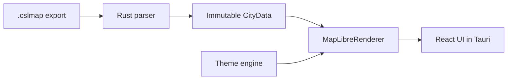
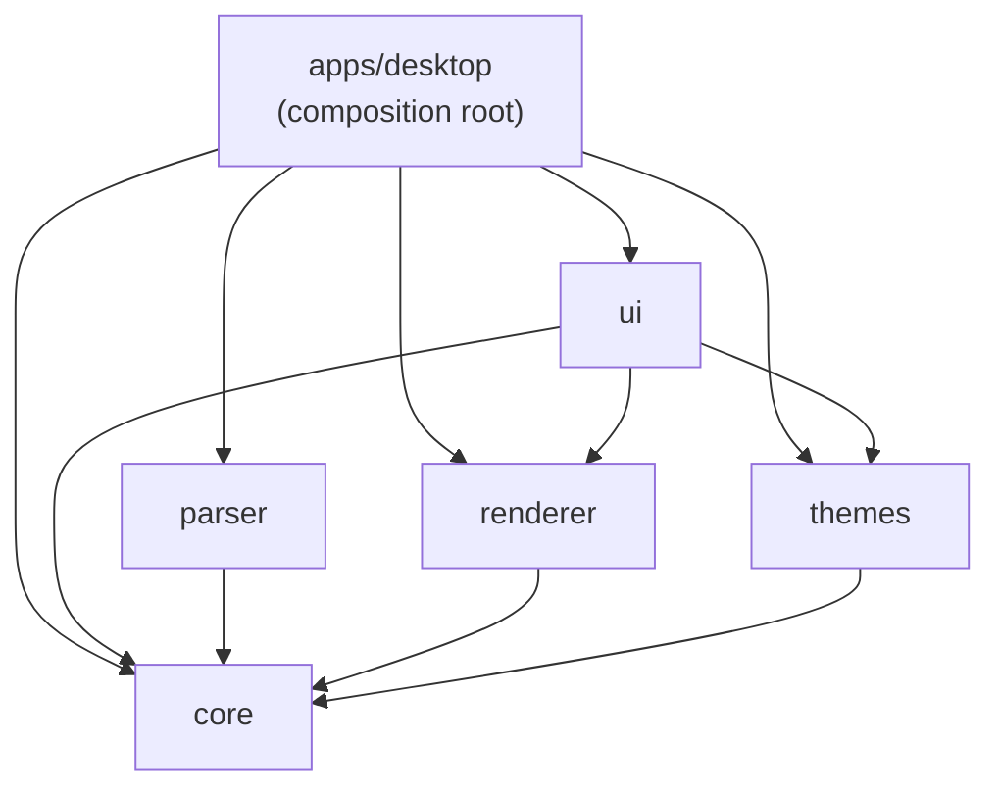

# Vellum

**A modern, cross-platform map viewer for Cities: Skylines 1.**

Your city took hundreds of hours to build. Vellum gives it a map worth keeping.

<p align="center">
  
</p>

[](https://github.com/sebas-tcotd/vellum/actions/workflows/ci.yml)
&nbsp;[](LICENSE)
&nbsp;·&nbsp;[Español](docs/README.es.md)

> Vellum is approaching its first public release. Packaging and distribution work are still in progress.

## What is Vellum?

Cities: Skylines lets you build entire worlds. Vellum is a native desktop app for exploring those worlds as coherent, interactive maps instead of leaving them inside the game or reducing them to screenshots.

Vellum renders terrain, water, roads, transit, buildings, forests and districts as independent map layers. It is designed around a simple belief: visual quality is part of the product, not decoration applied at the end.

The project is built for Windows, macOS and Linux with Tauri 2, Rust, React, TypeScript and MapLibre GL JS.

## The honest v1 workflow

For its first version, Vellum uses the community's existing export path:

1. Install [CSL Map View](https://steamcommunity.com/sharedfiles/filedetails/?id=845665815) in Cities: Skylines 1.
2. Use CSL Map View to export your city as a `.cslmap` file, then open that file in Vellum.

**CSL Map View is the exporter; Vellum is the modern viewer.** Vellum does not yet read a live city directly from the game. This two-tool workflow is intentional for v1: it lets Vellum provide a better exploration experience while preserving compatibility with the format the community already uses.

The longer-term direction is a Vellum-native exporter and a richer, versioned format produced through the Cities: Skylines modding API. That would remove the dependency on `.cslmap`, unlock data the legacy format cannot contain and support the next generation of Vellum features. It is a future direction, not a v1 requirement.

## What you can do today

- Open `.cslmap` files with drag and drop or `Ctrl+O` / `Cmd+O`
- Explore seven independent layers: terrain, water, roads, transit, buildings, forests and districts
- Pan and zoom a full city with GPU-accelerated MapLibre rendering
- Inspect transit lines and stops through contextual map interactions
- Use a minimap to stay oriented on large cities
- Toggle clean mode with `H` to view the map without interface chrome
- Switch between built-in visual themes
- Export the current view as PNG (1x–4x) or an editable SVG
- Load damaged files and unrecognized DLC assets through controlled fallbacks where possible
- Use the interface in English or Spanish
- Navigate core controls with keyboard-friendly interactions

## Installing a release build

Download the installer for your platform from the [latest GitHub Release](https://github.com/sebas-tcotd/vellum/releases/latest):

- **Windows** — run the `.msi`. It offers an opt-in checkbox to open `.cslmap` files with Vellum by default (unchecked unless you enable it), and the installer is signed so Windows should not warn about an unknown publisher.
- **macOS** — open the `.dmg` and drag Vellum into `Applications`. **v1 is not notarized by Apple**, so after moving the app you must clear the quarantine flag once, from a terminal:
  ```bash
  xattr -cr /Applications/Vellum.app
  ```
  Without this step, macOS Gatekeeper will refuse to open the app. This is a manual, honest limitation of the v1 release, not a substitute for notarization.
- **Linux** — run the `.AppImage` directly (`chmod +x` it first if needed).

## Try the development build

You do not need Cities: Skylines 1 or your own save to try the development build. The repository includes real `.cslmap` fixtures:

```bash
git clone https://github.com/sebas-tcotd/vellum.git
cd vellum
pnpm install
pnpm dev
```

Then drop one of these files onto the app window:

- [`altavento.cslmap`](packages/parser-cslmap/fixtures/altavento.cslmap)
- [`aurelia-del-delta.cslmap`](packages/parser-cslmap/fixtures/aurelia-del-delta.cslmap)

Useful controls:

| Action                      | Shortcut                            |
| --------------------------- | ----------------------------------- |
| Open a `.cslmap` file       | `Ctrl/Cmd+O`                        |
| Open the export dialog      | `Ctrl/Cmd+E`                        |
| Fit map to screen           | `Ctrl/Cmd+0` or `Ctrl/Cmd+9`        |
| Zoom in                     | `Ctrl/Cmd++` or `Ctrl/Cmd+=`        |
| Zoom out                    | `Ctrl/Cmd+-`                        |
| Toggle map layers           | `1`–`7`                             |
| Open advanced layer options | `Shift+1`–`Shift+7` where available |
| Toggle clean mode           | `H`                                 |
| Toggle navigation mode      | `Ctrl/Cmd+B`                        |
| Toggle icon legend          | `L`                                 |
| Rotate map                  | `Shift+←` / `Shift+→`               |
| Reset map north             | `R`                                 |

### Requirements

| Tool      | Version                             |
| --------- | ----------------------------------- |
| Node.js   | 20                                  |
| pnpm      | `10.33.0`                           |
| Rust      | `1.96.0` from `rust-toolchain.toml` |
| Tauri CLI | `2.x`                               |

Before running `pnpm install` or `pnpm dev`, install the [Tauri 2 prerequisites](https://v2.tauri.app/start/prerequisites/) for your operating system. In addition to Node.js, pnpm and Rust, Tauri requires native system dependencies: WebKitGTK and build tools on Linux, Xcode Command Line Tools on macOS, and Microsoft C++ Build Tools plus WebView2 on Windows. These dependencies are not installed by pnpm.

## Why Vellum exists

CSL Map View opened an important door: it showed the Cities: Skylines community that a city could be seen as a map. Vellum is not meant to erase that history. It is an attempt to carry the idea forward with a modern, cross-platform experience and a stronger cartographic focus.

The problem is not that players cannot build beautiful cities. It is that the work they put into those cities is difficult to understand, document and share outside the game. Vellum treats a `.cslmap` export as more than a data dump:

- roads are classified from their `ItemClass`, not guessed from names;
- transit is reconstructed from the game's route data and rendered as a readable network;
- terrain, water and elevation are represented as parts of a map rather than a flat screenshot;
- the domain model is separated from the renderer so the format can evolve without rewriting the map experience.

## Engineering story

Vellum started with a Canvas 2D renderer. As the map grew, CPU-rendered overscan and pan performance reached a hard ceiling. The project pivoted to MapLibre GL JS and WebGL after a focused spike proved that the target experience was achievable.

That pivot was possible because the project had already separated the domain model from rendering. Every renderer implements the same `IRenderer` port, while `@vellum/ui` depends on the port rather than a concrete implementation. The legacy Canvas renderer remains in the repository as a tested reference; the active desktop application uses the MapLibre renderer.



The package graph is intentionally one-directional:



`pnpm check:architecture` enforces these boundaries. `@vellum/core` remains the dependency-free domain and IPC layer; `apps/desktop` is the only composition root.

## Technical details worth knowing

- Map coordinates cover approximately ±8640 units on the X/Z axes.
- `LandArray` and `WaterArray` remain separate domain structures.
- `icls="Bus Line"` segments are virtual transit connectors and are never rendered as roads.
- Road width follows `fixed + scaled × zoomFactor`, with both components preserved in the style contract.
- Terrain and water use different rendering paths and elevation semantics.
- Real city fixtures are used during development; visual rendering bugs are not validated only against toy data.

The deeper implementation notes live in [`docs/`](docs), including the [transit rendering algorithm](docs/transit-rendering-algorithm.md), architecture references and the `.vellumstyle` schema documentation.

## Project status and roadmap

| Area                                                      | Status                  |
| --------------------------------------------------------- | ----------------------- |
| Project foundation, monorepo and IPC contract             | Complete                |
| File loading and Rust parser                              | Complete                |
| Cartographic rendering                                    | Complete                |
| Exploration UI and MapLibre migration                     | Complete                |
| Theme system and built-in themes                          | Complete                |
| PNG/SVG export                                            | Complete                |
| i18n, preferences and update checks                       | Complete                |
| Packaging and distribution (installers, file association) | Final release milestone |

The future Vellum-native export format is intentionally separate from the v1 viewer milestone. The first release can be useful while the project continues toward a richer in-game exporter and data model.

## Development commands

```bash
pnpm dev
pnpm build
pnpm lint
pnpm check:architecture
pnpm test
pnpm format:check
pnpm rust:fmt
pnpm rust:lint
pnpm rust:test
```

Run a focused package test with:

```bash
pnpm --filter @vellum/renderer-webgl test
pnpm --filter @vellum/ui test -- MapLibreRoot.test.tsx
```

The Playwright suite is configured under [`apps/desktop/tests/e2e`](apps/desktop/tests/e2e), but it is not part of the default CI pipeline yet.

## Repository guide

- [`docs/`](docs) — technical documentation and design references
- [`packages/core`](packages/core) — domain types and IPC contract
- [`packages/parser-cslmap`](packages/parser-cslmap) — `.cslmap` parsing adapter
- [`packages/renderer-webgl`](packages/renderer-webgl) — active MapLibre renderer
- [`packages/theme-engine`](packages/theme-engine) — theme loading, validation and style parameters
- [`packages/ui`](packages/ui) — React components and interaction layer
- Planning and implementation artifacts are maintained separately from the public runtime documentation.

## Contributing

See [`CONTRIBUTING.md`](CONTRIBUTING.md) for setup, testing and the PR flow. Please open an issue first for anything beyond a small fix so the direction can be discussed before work starts.

CI validates formatting, TypeScript, architecture boundaries, Vitest, Rust formatting, Clippy and Rust tests across the supported build matrix.

## License

[MIT](LICENSE)

## Acknowledgements

Built around the Cities: Skylines `.cslmap` export format and powered by [Tauri](https://tauri.app/), [Rust](https://www.rust-lang.org/), [React](https://react.dev/), [MapLibre GL JS](https://maplibre.org/) and [Turborepo](https://turborepo.com/).

The project is maintained by Sebastian Vargas and developed with a strong emphasis on understanding before building, coherent systems and reducing friction without hiding complexity.
