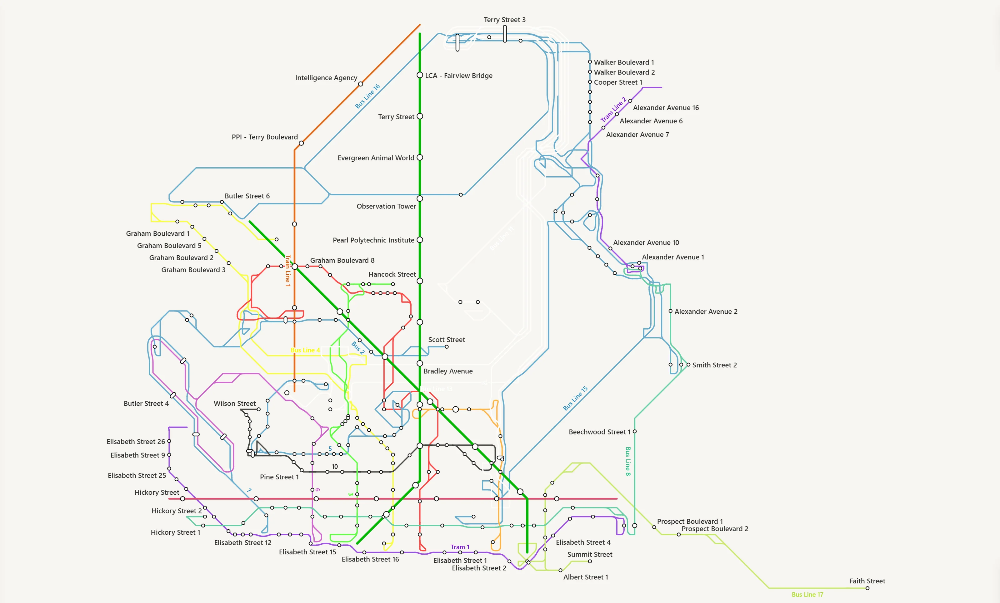
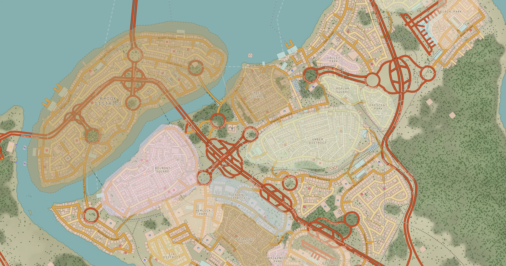
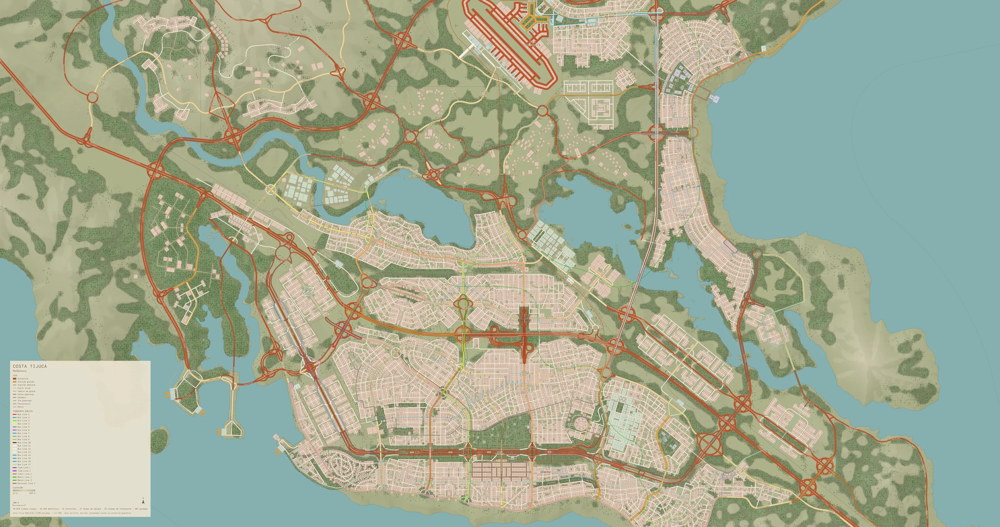
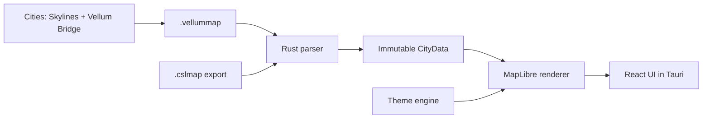
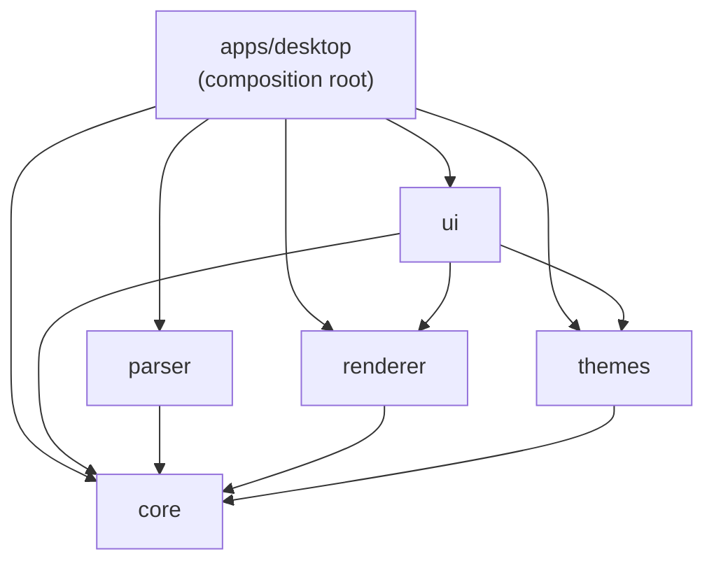

# Vellum

<p align="center">
  
</p>

<p align="center">
  <strong>Turn your Cities: Skylines city into a map worth keeping.</strong><br />
  A desktop map viewer for your city, and the in-game mod that exports it.
</p>

<p align="center">
  <a href="https://apps.microsoft.com/detail/9n65wg3v160t">
    <picture>
      <source media="(prefers-color-scheme: dark)" srcset="apps/landing/public/assets/store-badge-en-on-dark.svg" />
      
    </picture>
  </a>
  &nbsp;
  <a href="https://steamcommunity.com/sharedfiles/filedetails/?id=3815903587"></a>
  &nbsp;
  <a href="https://github.com/sebas-tcotd/vellum/releases/latest"></a>
</p>

<p align="center">
  <a href="https://sebas-tcotd.github.io/vellum/">Website</a>
  · <a href="https://sebas-tcotd.github.io/vellum/manifesto/">Manifesto</a>
  · <a href="docs/es/index.md">Documentación en español</a>
  · <a href="CONTRIBUTING.md">Contribute</a>
</p>

<p align="center">
  <a href="https://github.com/sebas-tcotd/vellum/actions/workflows/ci.yml"></a>
  <a href="LICENSE"></a>
  <a href="https://github.com/sebas-tcotd/vellum/releases/latest"></a>
</p>


## How it works

Vellum comes in two pieces. **Vellum Bridge exports, Vellum explores.**

| In the game: **Vellum Bridge**                                                          | On your desktop: **Vellum**                                        |
| --------------------------------------------------------------------------------------- | ------------------------------------------------------------------ |
| A Cities: Skylines mod that writes your city to a `.vellummap` file when you ask it to. | A map viewer for Windows, macOS and Linux that opens that file.    |
| Acts only on your keypress and never touches the network.                               | Runs locally. No account, no upload, no server between you and it. |

1. Subscribe to [Vellum Bridge on the Steam Workshop](https://steamcommunity.com/sharedfiles/filedetails/?id=3815903587) and enable it in the game's Content Manager.
2. Load your city and press <kbd>Ctrl</kbd>+<kbd>Shift</kbd>+<kbd>E</kbd>. Bridge writes a `.vellummap` to `Vellum Bridge/<your city>/`, inside Documents on Windows and your home folder on macOS and Linux.
3. Drop that file onto Vellum, or open it with <kbd>Ctrl/Cmd</kbd>+<kbd>O</kbd>.

A `.vellummap` carries what older formats cannot: street names, district population and jobs, renamed and unique buildings, and stations that group every stop they serve.

> [!TIP]
> Already have exports from [CSL Map View](https://steamcommunity.com/sharedfiles/filedetails/?id=845665815)? Vellum still opens `.cslmap` files and keeps its three classic styles, so your existing maps keep working.

## Install

| Platform    | Where                                                                    | Notes                                                      |
| ----------- | ------------------------------------------------------------------------ | ---------------------------------------------------------- |
| **Windows** | [Microsoft Store](https://apps.microsoft.com/detail/9n65wg3v160t)        | Recommended. The Store keeps Vellum up to date.            |
| Windows     | [GitHub Releases](https://github.com/sebas-tcotd/vellum/releases/latest) | Standalone `.exe` installer, or `.msi` for managed setups. |
| macOS       | [GitHub Releases](https://github.com/sebas-tcotd/vellum/releases/latest) | `.dmg`. Not notarized by Apple: see the notes below.       |
| Linux       | [GitHub Releases](https://github.com/sebas-tcotd/vellum/releases/latest) | `.AppImage`, plus `.deb` and `.rpm` packages.              |

<details>
<summary>Platform notes</summary>

- **Windows (standalone):** the `.exe` and `.msi` installers are not Authenticode-signed and may show an unknown-publisher warning; check each release's `signing-evidence.md`. The `.msi` offers an opt-in `.cslmap` file association. The Store package is signed by Microsoft.
- **macOS:** open the `.dmg` and move Vellum to `Applications`. Vellum is not signed or notarized, so if Gatekeeper blocks it, clear quarantine once with `xattr -cr /Applications/Vellum.app`.
- **Linux:** make the `.AppImage` executable and run it.

What each platform gets and what its signing state means: [Packaging and installers](docs/en/packaging-and-installers.md) · [Empaquetado e instaladores](docs/es/packaging-and-installers.md).

</details>

## What you can do

| Read the transit network                                                                                          | …or as a schematic diagram                                                                                                                 |
| ----------------------------------------------------------------------------------------------------------------- | ------------------------------------------------------------------------------------------------------------------------------------------ |
|                    |                                    |
| **Inspect districts and streets**                                                                                 | **Export a print-ready plate**                                                                                                             |
|  |  |

- **Explore** seven independent layers (terrain, basemap and water, roads, transit, buildings, forests and districts) with <kbd>Shift</kbd>+<kbd>1</kbd>–<kbd>7</kbd>, down to street names and real road widths.
- **Read the transit** as a geographic map or as an octilinear or orthoradial schematic, with stations collapsed into single nodes.
- **Inspect** a district, park or building in a side card: population, homes, jobs and specializations.
- **Make it yours** with five built-in themes, or load your own [`.vellumstyle`](docs/en/vellumstyle-schema.md). Press <kbd>H</kbd> for clean mode.
- **Export** the current view as PNG (1×–4×) or editable SVG.
- **Stay oriented** with the minimap, precise zoom and a shortcuts sheet (<kbd>?</kbd>), in English or Spanish.

> [!NOTE]
> **Your city stays yours.** Vellum works offline on your machine and needs no account. The [manifesto](https://sebas-tcotd.github.io/vellum/manifesto/) explains why that matters.

## Where it's heading

Vellum 1.0 is the map I wanted to build. Some ideas being explored for later, with no dates attached:

- a **timelapse** of how a city grew, built from successive exports;
- **3D terrain** and building heights;
- a **nautical chart** style for the sea around your city.

Have a city that breaks Vellum, or an idea that would help you read yours? [Open an issue](https://github.com/sebas-tcotd/vellum/issues).

## Contributing

Vellum is open source under the MIT license, and contributions of every size are welcome: rendering quality, parser resilience, themes, documentation, or a well-described issue. Please read [`CONTRIBUTING.md`](CONTRIBUTING.md) before opening a pull request. For security issues, use [`SECURITY.md`](SECURITY.md); for community expectations, see [`CODE_OF_CONDUCT.md`](CODE_OF_CONDUCT.md).

### Try it from source

You do not need Cities: Skylines or your own save to try the development build. The repository includes real city fixtures.

```bash
git clone https://github.com/sebas-tcotd/vellum.git
cd vellum
pnpm install
pnpm dev
```

Drop [`altavento.cslmap`](packages/parser-cslmap/fixtures/altavento.cslmap) or [`aurelia-del-delta.cslmap`](packages/parser-cslmap/fixtures/aurelia-del-delta.cslmap) onto the app window.

<details>
<summary>Development requirements</summary>

| Tool      | Version                             |
| --------- | ----------------------------------- |
| Node.js   | 20                                  |
| pnpm      | `10.33.0`                           |
| Rust      | `1.96.0` from `rust-toolchain.toml` |
| Tauri CLI | 2.x                                 |

Before `pnpm install` or `pnpm dev`, install the [Tauri 2 prerequisites](https://v2.tauri.app/start/prerequisites/) for your operating system.

</details>

<details>
<summary>Useful commands</summary>

```bash
pnpm dev
pnpm build
pnpm lint
pnpm check:architecture
pnpm test
pnpm test:e2e
pnpm format:check
pnpm rust:fmt
pnpm rust:lint
pnpm rust:test
pnpm release:verify
```

Run a focused package test with:

```bash
pnpm --filter @vellum/renderer-webgl test
pnpm --filter @vellum/ui test -- MapLibreRoot.test.tsx
```

</details>

<details>
<summary>Repository map</summary>

| Path                                                 | Purpose                                           |
| ---------------------------------------------------- | ------------------------------------------------- |
| [`apps/desktop`](apps/desktop)                       | Tauri shell, native commands and composition root |
| [`packages/core`](packages/core)                     | Domain types and IPC contract                     |
| [`packages/parser-cslmap`](packages/parser-cslmap)   | `.cslmap` and `.vellummap` readers                |
| [`packages/renderer-webgl`](packages/renderer-webgl) | Active MapLibre renderer                          |
| [`packages/theme-engine`](packages/theme-engine)     | Theme loading, validation and style parameters    |
| [`packages/ui`](packages/ui)                         | React components and interaction layer            |
| [`tools/vellum-bridge`](tools/vellum-bridge)         | Cities: Skylines mod that exports `.vellummap`    |
| [`apps/landing`](apps/landing)                       | Project website on GitHub Pages                   |
| [`docs`](docs)                                       | Technical documentation and design references     |
| [`docs/adr`](docs/adr)                               | Accepted architecture decision records            |

</details>

### The engineering story

Vellum began with a Canvas 2D renderer. As maps grew, CPU rendering hit a ceiling, and a focused spike proved that MapLibre GL JS and WebGL could deliver the experience. The pivot was possible because the domain model was separated from rendering from the start; the Canvas renderer was retired in [ADR-0001](docs/adr/0001-rendering-ownership.md). The package graph is one-directional, and `pnpm check:architecture` enforces it.


```mermaid
flowchart LR
  G["Cities: Skylines + Vellum Bridge"] --> V[".vellummap"]
  V --> B["Rust parser"]
  A[".cslmap export"] --> B
  B --> C["Immutable CityData"]
  C --> D["MapLibre renderer"]
  D --> E["React UI in Tauri"]
  T["Theme engine"] --> D
```

<details>
<summary>Package graph</summary>


```mermaid
graph TD
  desktop["apps/desktop<br/>(composition root)"] --> ui
  desktop --> parser
  desktop --> renderer
  desktop --> themes
  desktop --> core
  ui --> renderer
  ui --> themes
  ui --> core
  parser --> core
  renderer --> core
  themes --> core
```

`@vellum/core` is the dependency-free domain and IPC layer. `apps/desktop` is the only composition root. The active `MapLibreRoot` still uses MapLibre-specific APIs at the UI boundary, so renderer interchangeability is a deliberate architectural direction rather than a claim that every edge is already abstracted.

</details>

`.vellummap` is a versioned, schema-validated city document that does not depend on the program that wrote it. Its contract lives in [`docs/es/vellummap-format.md`](docs/es/vellummap-format.md).

## License

Vellum is released under the [MIT License](LICENSE).

## Acknowledgements

Built for the Cities: Skylines community, compatible with the `.cslmap` format from [CSL Map View](https://steamcommunity.com/sharedfiles/filedetails/?id=845665815), and powered by [Tauri](https://tauri.app/), [Rust](https://www.rust-lang.org/), [React](https://react.dev/), [MapLibre GL JS](https://maplibre.org/) and [Turborepo](https://turborepo.com/).

Cities shown in this README: [_Costa Tijuca_](https://steamcommunity.com/sharedfiles/filedetails/?id=3346079784) by MatBarbosa and [_Pepper Lake_](https://steamcommunity.com/sharedfiles/filedetails/?id=1568162351) by takkerue, from the Steam Workshop.

**Created and maintained by Sebastian Vargas**, with an emphasis on understanding before building, coherent systems and reducing friction without hiding complexity.
