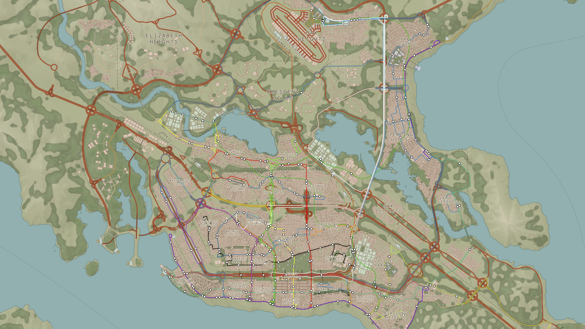
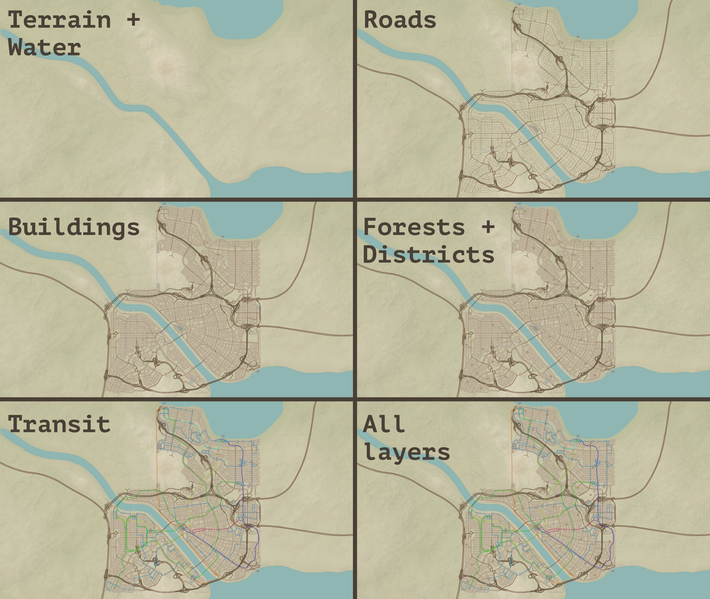
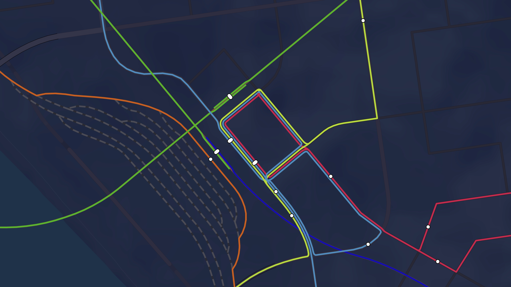
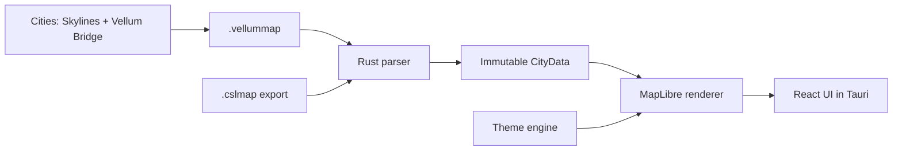
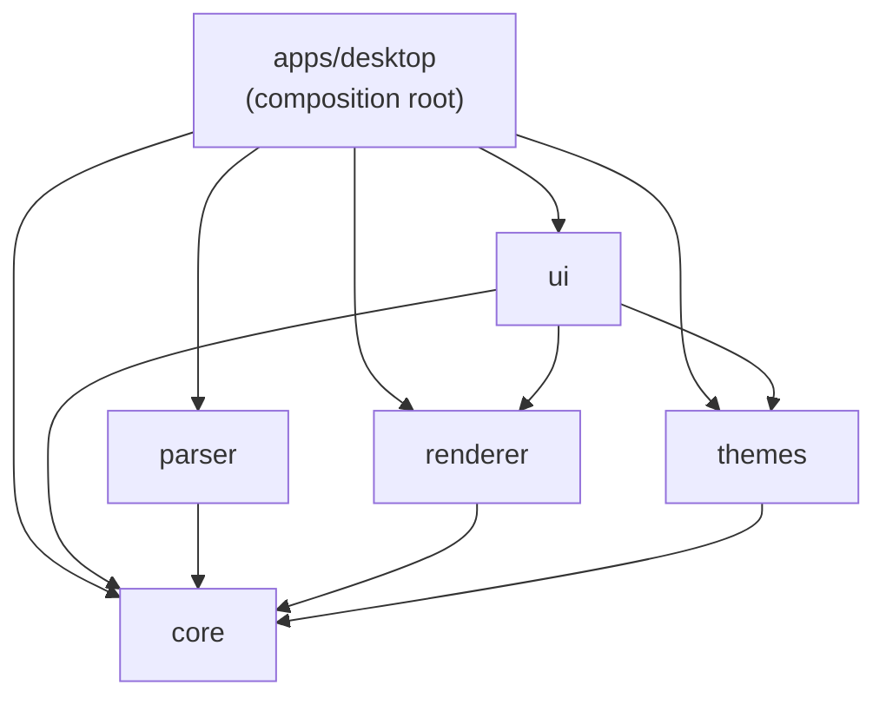

# Vellum

<p align="center">
  
</p>

<p align="center">
  <strong>Turn your Cities: Skylines city into a map worth keeping.</strong><br />
  A modern, cross-platform viewer for exploring, understanding and sharing your city.
</p>

<p align="center">
  <a href="https://github.com/sebas-tcotd/vellum/releases/latest">Download the latest release</a>
  · <a href="docs/es/index.md">Leer en español</a>
  · <a href="CONTRIBUTING.md">Contribute</a>
</p>

<p align="center">
  <a href="https://github.com/sebas-tcotd/vellum/actions/workflows/ci.yml"></a>
  <a href="LICENSE"></a>
  <a href="https://github.com/sebas-tcotd/vellum/releases/latest"></a>
</p>

> **For players:** export your city with Vellum Bridge and explore it as a real interactive map.
> **For contributors:** help build the open-source cartographic toolkit that Cities: Skylines has been missing.



## Why Vellum?

Cities: Skylines lets you build entire worlds. Vellum gives those worlds a second life outside the game: a native desktop experience for exploring terrain, roads, transit, buildings, forests and districts as coherent, layered maps.

The core idea is simple: **the visual quality of a city is part of the product, not decoration applied at the end.**

Vellum runs on Windows, macOS and Linux using Tauri 2, Rust, React, TypeScript and MapLibre GL JS.

## Start here

### Download and open a city

1. Download the installer for your platform from the [latest GitHub Release](https://github.com/sebas-tcotd/vellum/releases/latest).
2. In Cities: Skylines, enable the <!-- TODO(workshop): link the Steam Workshop page once published --> [Vellum Bridge](tools/vellum-bridge) mod, load your city and press **Ctrl+Shift+E**. Bridge writes a `.vellummap` to `Vellum Bridge/<your city>/`, inside Documents on Windows and your home folder on macOS and Linux.
3. Drop that file onto Vellum, or open it with `Ctrl/Cmd+O`.

**Vellum Bridge exports, Vellum explores.** Bridge only acts when you ask it to and never touches the network. Its `.vellummap` carries what the older formats cannot: street names, district population and jobs, renamed and unique buildings, and stations that group every stop they serve.

Already have exports from [CSL Map View](https://steamcommunity.com/sharedfiles/filedetails/?id=845665815)? Vellum still opens `.cslmap` files, so your existing maps keep working.

<details>
<summary>Platform notes</summary>

- **Windows:** run the `.exe` installer (recommended). An `.msi` is also published, with opt-in `.cslmap` file association. Releases are configured for Authenticode signing; an explicitly unsigned build may show an unknown-publisher warning.
- **macOS:** open the `.dmg` and move Vellum to `Applications`. v1 is not notarized by Apple, so clear quarantine once with `xattr -cr /Applications/Vellum.app` if Gatekeeper blocks it.
- **Linux:** make the `.AppImage` executable and run it. `.deb` and `.rpm` packages are also published.

Which artifact each platform gets, what is actually customisable in it, and what
its signing state means: [Packaging and installers](docs/en/packaging-and-installers.md)
· [Empaquetado e instaladores](docs/es/packaging-and-installers.md).

</details>

### Try it from source

You do not need Cities: Skylines 1 or your own save to try the development build. The repository includes real city fixtures.

```bash
git clone https://github.com/sebas-tcotd/vellum.git
cd vellum
pnpm install
pnpm dev
```

Drop [`altavento.cslmap`](packages/parser-cslmap/fixtures/altavento.cslmap) or [`aurelia-del-delta.cslmap`](packages/parser-cslmap/fixtures/aurelia-del-delta.cslmap) onto the app window.

<details>
<summary>Development requirements</summary>

| Tool      | Version                             |
| --------- | ----------------------------------- |
| Node.js   | 20                                  |
| pnpm      | `10.33.0`                           |
| Rust      | `1.96.0` from `rust-toolchain.toml` |
| Tauri CLI | 2.x                                 |

Before `pnpm install` or `pnpm dev`, install the [Tauri 2 prerequisites](https://v2.tauri.app/start/prerequisites/) for your operating system.

</details>

## What you can do today

- Open `.vellummap` and `.cslmap` files with drag and drop or `Ctrl/Cmd+O`.
- Explore seven independent layers: terrain, basemap and water, roads, transit, buildings, forests and districts, each with its own options (`Shift+1`–`7`).
- Pan and zoom a full city with GPU-accelerated MapLibre rendering, down to street names and real road widths at detail zoom.
- Read the transit network as a geographic map or as an octilinear schematic diagram, with stations collapsed into single nodes.
- Inspect a district, park or building in a side card: population, homes, jobs and specializations.
- Color districts by specialization, and show forests as tree crowns, circles or a heatmap.
- Stay oriented with the minimap, precise zoom and a keyboard shortcuts sheet (`?`).
- Toggle clean mode with `H` and switch between five built-in themes, or load your own `.vellumstyle`.
- Use the interface in English or Spanish.
- Export the current view as PNG (1×–4×) or editable SVG.
- Load damaged files and unknown-DLC assets through controlled fallbacks where possible.



Layers reveal the city; transit turns its infrastructure into a readable network.



## The engineering story

Vellum began with a Canvas 2D renderer. As maps grew, CPU-rendered overscan hit a performance ceiling. A focused spike proved that MapLibre GL JS and WebGL could deliver the target experience, so the active renderer moved there. The Canvas implementation was retired in [ADR-0001](docs/adr/0001-rendering-ownership.md) once it had no runtime importers left; it lives on in git history.

That pivot was possible because the domain model was separated from rendering from the start. The package graph is intentionally one-directional, and `pnpm check:architecture` enforces it.


```mermaid
flowchart LR
  G["Cities: Skylines + Vellum Bridge"] --> V[".vellummap"]
  V --> B["Rust parser"]
  A[".cslmap export"] --> B
  B --> C["Immutable CityData"]
  C --> D["MapLibre renderer"]
  D --> E["React UI in Tauri"]
  T["Theme engine"] --> D
```


```mermaid
graph TD
  desktop["apps/desktop<br/>(composition root)"] --> ui
  desktop --> parser
  desktop --> renderer
  desktop --> themes
  desktop --> core
  ui --> renderer
  ui --> themes
  ui --> core
  parser --> core
  renderer --> core
  themes --> core
```

`@vellum/core` is the dependency-free domain and IPC layer. `apps/desktop` is the only composition root. The active `MapLibreRoot` still uses MapLibre-specific APIs at the UI boundary, so renderer interchangeability is a deliberate architectural direction rather than a claim that every edge is already abstracted.

## Project status

| Area                                          | Status      |
| --------------------------------------------- | ----------- |
| File loading, Rust parser and domain model    | Complete    |
| Cartographic rendering and MapLibre migration | Complete    |
| Exploration UI, layers and themes             | Complete    |
| PNG/SVG export                                | Complete    |
| i18n, preferences and update checks           | Complete    |
| Packaging and distribution                    | Complete    |
| Vellum Bridge exporter and `.vellummap`       | Complete    |
| Transit schematic view                        | Complete    |
| Steam Workshop release of Vellum Bridge       | In progress |

`.vellummap` is a versioned, schema-validated city document that does not depend on the program that wrote it. Its contract lives in [`docs/es/vellummap-format.md`](docs/es/vellummap-format.md).

<!--
VISUAL: Optional theme comparison — one cartographic scene, three visual languages.
PURPOSE: Support the claim that Vellum treats visual quality as part of the product and that
themes are a real presentation tool, not a color-picker demo.
COMPOSITION:
- Reuse the exact same city, camera, visible layers and crop for three side-by-side panels.
- Use `spring-valley.cslmap` in `Day`, `Transit Dim` and `Transit`. This makes the comparison
  about changing the map's visual focus, not merely swapping arbitrary color palettes.
- Do not include all five themes: three is enough to show range without turning the README
  into a theme gallery.
- Use a regional-to-city-wide view with a strong river/coastline and visible urban structure.
  Avoid a featureless suburb where the palette differences disappear.
- Use clean mode and add small external labels beneath each panel. Do not add decorative
  frames, fake browser chrome or color swatches detached from the map.
FORMAT: 3:1 or 16:9 WebP, ideally 1800×600 for a strip or 1800×1000 for a three-panel card.
SUGGESTED PATH: `docs/assets/readme/theme-comparison-spring-valley.webp`
PLACEMENT: Optional; place after the project-status paragraph and before `## Repository map`.
Skip it if the hero and layer composition already establish the visual identity strongly.
-->

## Repository map

| Path                                                 | Purpose                                           |
| ---------------------------------------------------- | ------------------------------------------------- |
| [`apps/desktop`](apps/desktop)                       | Tauri shell, native commands and composition root |
| [`packages/core`](packages/core)                     | Domain types and IPC contract                     |
| [`packages/parser-cslmap`](packages/parser-cslmap)   | `.cslmap` and `.vellummap` readers                |
| [`packages/renderer-webgl`](packages/renderer-webgl) | Active MapLibre renderer                          |
| [`packages/theme-engine`](packages/theme-engine)     | Theme loading, validation and style parameters    |
| [`packages/ui`](packages/ui)                         | React components and interaction layer            |
| [`tools/vellum-bridge`](tools/vellum-bridge)         | Cities: Skylines mod that exports `.vellummap`    |
| [`apps/landing`](apps/landing)                       | Project website on GitHub Pages                   |
| [`docs`](docs)                                       | Technical documentation and design references     |
| [`docs/adr`](docs/adr)                               | Accepted architecture decision records            |

## Useful commands

```bash
pnpm dev
pnpm build
pnpm lint
pnpm check:architecture
pnpm test
pnpm test:e2e
pnpm format:check
pnpm rust:fmt
pnpm rust:lint
pnpm rust:test
pnpm release:verify
```

Run a focused package test with:

```bash
pnpm --filter @vellum/renderer-webgl test
pnpm --filter @vellum/ui test -- MapLibreRoot.test.tsx
```

## Join the project

Vellum is early enough for thoughtful contributions to shape the product: rendering quality, parser resilience, export workflows, themes, documentation and community tooling are all meaningful surfaces.

Please read [`CONTRIBUTING.md`](CONTRIBUTING.md) before opening a pull request. For security issues, use [`SECURITY.md`](SECURITY.md); for community expectations, see [`CODE_OF_CONDUCT.md`](CODE_OF_CONDUCT.md).

If you are unsure where to begin, open an issue and describe the city workflow or problem you want to improve. A good issue is already a contribution.

## License

Vellum is released under the [MIT License](LICENSE).

## Acknowledgements

Built for the Cities: Skylines community, compatible with the `.cslmap` format from [CSL Map View](https://steamcommunity.com/sharedfiles/filedetails/?id=845665815), and powered by [Tauri](https://tauri.app/), [Rust](https://www.rust-lang.org/), [React](https://react.dev/), [MapLibre GL JS](https://maplibre.org/) and [Turborepo](https://turborepo.com/).

**Created and maintained by Sebastian Vargas**, with an emphasis on understanding before building, coherent systems and reducing friction without hiding complexity.
