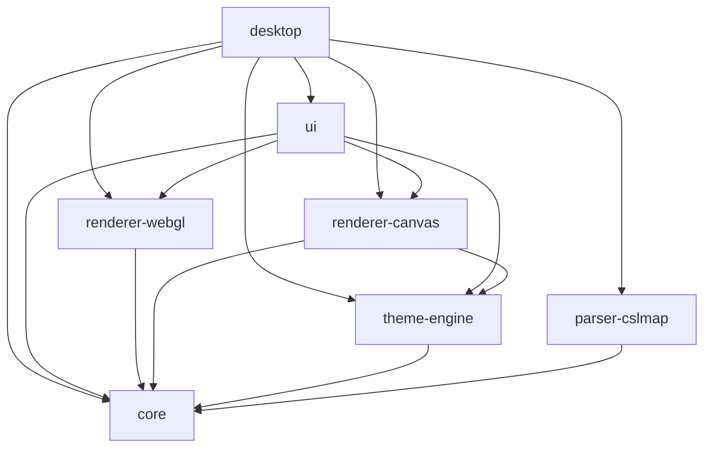

# Vellum

**Visor de escritorio para archivos `.cslmap` de Cities: Skylines.** Arrastra una exportación de mapa y explórala con renderizado WebGL fluido, controles de capas y navegación por teclado.

Construido con Tauri 2 (Rust) + React 19 + TypeScript, organizado como monorepo con pnpm + Turborepo.

[](https://github.com/sebas-tcotd/vellum/actions/workflows/ci.yml)
&nbsp;[](../LICENSE)
&nbsp;·&nbsp;[English](../README.md)

---

## Para Usuarios

### Funcionalidades

- **Abrir archivos `.cslmap`** — arrastra y suelta o usa `Ctrl+O` / `Cmd+O`
- **7 capas de mapa** — activa/desactiva terreno, agua, calles, tránsito, edificios, bosques y distritos
- **Renderizado WebGL fluido** — acelerado por GPU vía MapLibre GL JS, paneo/zoom a 30+ fps
- **Explorador de tránsito** — inspecciona rutas de bus, metro, tren, tranvía y otros modos
- **Tooltips en el mapa** — al pasar el cursor sobre una parada de tránsito, muestra las líneas que la sirven
- **Minimapa** — orientación rápida con una vista general en la esquina
- **Exportación PNG/SVG** — `Ctrl/Cmd+E` abre el diálogo de exportación; PNG en 1x–4x o SVG editable
- **Atajos de teclado** — `Ctrl/Cmd+O` abre un archivo, `Ctrl/Cmd+E` exporta la vista actual, `Ctrl/Cmd+0` o `Ctrl/Cmd+9` ajustan el mapa a pantalla, `1-7` alternan capas, `H` activa el modo limpio, `Ctrl/Cmd+B` alterna el modo navegación, `L` muestra la leyenda, `Shift+←/→` rota el mapa y `R` restablece el norte
- **Opciones avanzadas** — `Shift+1`–`Shift+7` abre las opciones de una capa cuando están disponibles
- **Modo limpio** — `H` oculta toda la interfaz para una vista sin distracciones
- **Dos idiomas** — interfaz en inglés y español
- **Carga parcial** — abre mapas dañados o con DLC pesados con fallback controlado

### Requisitos

| Herramienta | Versión                        | Verificar              |
| ----------- | ------------------------------ | ---------------------- |
| Node.js     | 20                             | `node --version`       |
| pnpm        | 10.33.0                        | `pnpm --version`       |
| Rust        | 1.96.0 (`rust-toolchain.toml`) | `rustc --version`      |
| Tauri CLI   | 2.x                            | `pnpm tauri --version` |

> Antes de ejecutar `pnpm install` o `pnpm dev`, instala los [prerrequisitos de Tauri 2](https://v2.tauri.app/start/prerequisites/) para tu sistema operativo. Además de Node.js, pnpm y Rust, Tauri requiere dependencias nativas: WebKitGTK y herramientas de compilación en Linux, Xcode Command Line Tools en macOS, y Microsoft C++ Build Tools junto con WebView2 en Windows. Estas dependencias no las instala pnpm.

### Instalar una versión publicada

Descarga el instalador de tu plataforma desde la [última Release en GitHub](https://github.com/sebas-tcotd/vellum/releases/latest):

- **Windows** — ejecuta el `.msi`. Incluye un checkbox opcional para abrir archivos `.cslmap` con Vellum por defecto (desmarcado salvo que lo actives), y el instalador está firmado, por lo que Windows no debería advertir sobre un editor desconocido.
- **macOS** — abre el `.dmg` y arrastra Vellum a `Aplicaciones`. **La v1 no está notarizada por Apple**, así que después de moverla debes quitar el flag de cuarentena una vez, desde una terminal:
  ```bash
  xattr -cr /Applications/Vellum.app
  ```
  Sin este paso, Gatekeeper de macOS se negará a abrir la app. Es una limitación manual y honesta de la v1, no un sustituto de la notarización.
- **Linux** — ejecuta el `.AppImage` directamente (dale permisos con `chmod +x` si hace falta).

### Inicio Rápido

```bash
git clone https://github.com/sebas-tcotd/vellum.git
cd vellum
pnpm install          # o pnpm approve-builds && pnpm install si esbuild está bloqueado
pnpm dev              # abre la ventana nativa
```

### Estado del Proyecto

| Épica | Área                        | Estado         |
| ----- | --------------------------- | -------------- |
| 1     | Fundación del proyecto      | ✅ Completado  |
| 2     | Carga de archivos y parser  | ✅ Completado  |
| 3     | Renderizado cartográfico    | ✅ Completado  |
| 4     | Exploración e interfaz      | ✅ Completado  |
| 5     | Sistema de temas            | ✅ Completado  |
| 6     | Exportación PNG/SVG         | ✅ Completado  |
| 7     | i18n, preferencias, updates | ✅ Completado  |
| 7.5   | Empaquetado y distribución  | 🔜 En progreso |

---

## Para Desarrolladores

### Arquitectura

El proyecto sigue Clean Architecture con dependencias estrictamente unidireccionales. Cada paquete `@vellum/*` es un módulo autocontenido con una única responsabilidad.

```
vellum/
├── apps/
│   └── desktop/                ← Shell Tauri + Vite/React (Composition Root)
│       ├── src/                ← Entry point React: main.tsx, hooks
│       └── src-tauri/          ← Backend Rust: comandos IPC, plugins Tauri
├── packages/
│   ├── core/                   ← Tipos de dominio, contrato IPC, interfaces
│   ├── parser-cslmap/          ← Adaptador Rust + TS: XML .cslmap → CityData
│   ├── renderer-webgl/         ← Renderizador MapLibre GL JS (activo)
│   ├── renderer-canvas/        ← Renderizador Canvas 2D (legado — reemplazado por WebGL)
│   ├── theme-engine/           ← .vellumstyle → RenderStyleParams
│   └── ui/                     ← Componentes React, store Zustand, i18n
└── docs/                       ← Documentación
```

### Grafo de Dependencias



`@vellum/core` tiene cero dependencias internas — es la capa de entidades pura. `desktop` es el único Composition Root y puede importar cualquier paquete.

### Flujo de Datos

```
Archivo .cslmap (disco)
       │
       ▼
 parser-cslmap (Rust vía IPC Tauri)
       │
       ▼
 CityData (modelo de dominio inmutable — @vellum/core)
       │
       ▼
 MapLibreRenderer (WebGL via MapLibre GL JS — @vellum/renderer-webgl)
       │
       ▼
 MapLibreRoot (React — @vellum/ui)
       │
       ▼
 Ventana nativa Tauri (apps/desktop)
```

### Stack Tecnológico

| Capa                | Tecnología                           |
| ------------------- | ------------------------------------ |
| Shell de escritorio | Tauri 2 + Rust                       |
| UI                  | React 19 + TypeScript                |
| Renderizado         | MapLibre GL JS (WebGL)               |
| Build / Dev server  | Vite 7                               |
| Orquestador         | Turborepo                            |
| Gestor de paquetes  | pnpm 10.33.0                         |
| Parser XML          | quick-xml 0.36 (Rust)                |
| Estado              | Zustand 5                            |
| i18n                | react-i18next + i18next              |
| Estilos             | Tailwind CSS 4 + shadcn/ui (Radix)   |
| Tests (TS)          | Vitest                               |
| Tests (Rust)        | cargo test                           |
| Tests (E2E)         | Playwright (flujo smoke configurado) |

### Comandos

| Comando                    | Descripción                                       |
| -------------------------- | ------------------------------------------------- |
| `pnpm dev`                 | Inicia modo desarrollo (Vite + Tauri, hot-reload) |
| `pnpm build`               | Compila todos los paquetes en orden topológico    |
| `pnpm lint`                | Verificación de tipos TypeScript (`tsc --noEmit`) |
| `pnpm check:architecture`  | Verifica reglas de importación entre paquetes     |
| `pnpm test`                | Ejecuta todos los tests (Vitest + cargo test)     |
| `pnpm format`              | Prettier --write                                  |
| `cargo clippy --workspace` | Linter de Rust                                    |
| `pnpm --filter <pkg> test` | Testea un paquete específico                      |

#### Solo frontend (sin proceso Tauri)

```bash
cd apps/desktop && pnpm dev:vite
```

#### Limpiar artefactos de build obsoletos

```bash
rm -rf .turbo apps/desktop/dist packages/*/dist
find . -name "tsconfig.tsbuildinfo" -delete && pnpm build
```

### Reglas de Arquitectura

- **Solo barrel imports** — siempre `import { X } from '@vellum/core'`, nunca `from '@vellum/core/src/...'`
- **Sin `any`** — `@typescript-eslint/no-explicit-any: error`. Usar `unknown` + type guards.
- **`unwrap()` / `expect()` prohibidos** en Rust de producción — todos los errores son `Result<T, VellumError>`
- **`LandArray` y `WaterArray`** son estructuras separadas — nunca unificarlas en un heightmap
- **Segmentos `Bus Line`** son conectores virtuales — nunca renderizar como geometría vial
- **Anchos de vía** siempre exponen componentes `fixed + scaled`, nunca un valor precalculado
- **`VellumError.reason`** es solo para logging — mapear `type` a claves i18n en la UI, nunca mostrar el string raw

### Tests

- **Vitest** configurado en raíz vía `vitest.workspace.ts` — 80+ archivos de test en todos los paquetes
- **Tests Rust** vía `cargo test --workspace` — tests unitarios del parser con fixtures `.cslmap` reales
- **E2E** Playwright configurado en `apps/desktop/tests/e2e` con el flujo smoke crítico (drag&drop → render → export)
- Los archivos `.cslmap` de prueba reales están en `packages/parser-cslmap/fixtures/`

### CI/CD

| Workflow                                                        | Trigger          | Propósito                                      |
| --------------------------------------------------------------- | ---------------- | ---------------------------------------------- |
| [ci.yml](../.github/workflows/ci.yml)                           | Push/PR a `main` | Build, test (Rust + TS), lint (TS + Clippy)    |
| [publish-release.yml](../.github/workflows/publish-release.yml) | Tag `v*`         | Build multiplataforma + publicación de release |

### Documentación

Documentación adicional en este mismo directorio (`docs/`):

- [Project Overview](project-overview.md)
- [Development Guide](development-guide.md)
- [Integration Architecture](integration-architecture.md)
- [Architecture — Desktop](architecture-desktop.md)
- [Source Tree Analysis](source-tree-analysis.md)
- [Component Inventory](component-inventory-desktop.md)
- [README (English)](../README.md)

## Contribuir

Consulta [`CONTRIBUTING.md`](../CONTRIBUTING.md) para clonar, instalar y el flujo de PR. Abre un issue primero para cualquier cambio que no sea un fix pequeño.

## Licencia

[MIT](../LICENSE)
