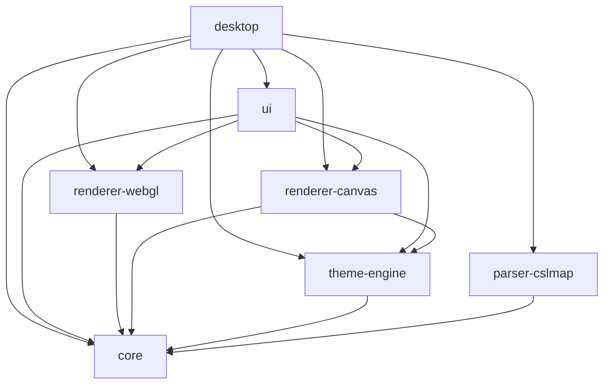

# Vellum

**Visor de escritorio para archivos `.cslmap` de Cities: Skylines.** Arrastra una exportación de mapa y explórala con renderizado WebGL fluido, controles de capas y navegación por teclado.

Construido con Tauri 2 (Rust) + React 19 + TypeScript, organizado como monorepo con pnpm + Turborepo.

---

## Para Usuarios

### Funcionalidades

- **Abrir archivos `.cslmap`** — arrastra y suelta o usa `Ctrl+O` / `Cmd+O`
- **7 capas de mapa** — activa/desactiva terreno, agua, calles, tránsito, edificios, bosques y distritos
- **Renderizado WebGL fluido** — acelerado por GPU vía MapLibre GL JS, paneo/zoom a 30+ fps
- **Explorador de tránsito** — inspecciona rutas de bus, metro, tren, tranvía y otros modos
- **Tooltips en el mapa** — al pasar el cursor sobre una parada de tránsito, muestra las líneas que la sirven
- **Minimapa** — orientación rápida con una vista general en la esquina
- **Atajos de teclado** — `1-7` alternan capas, `+/-` zoom, `Tab` modo limpio, `H` oculta paneles
- **Modo limpio** — `Tab` oculta toda la interfaz para una vista sin distracciones
- **Dos idiomas** — interfaz en inglés y español
- **Carga parcial** — abre mapas dañados o con DLC pesados con fallback controlado

### Requisitos

| Herramienta | Versión               | Verificar              |
| ----------- | --------------------- | ---------------------- |
| Node.js     | LTS ≥ 18              | `node --version`       |
| pnpm        | 10.33.0               | `pnpm --version`       |
| Rust        | stable (edition 2021) | `rustc --version`      |
| Tauri CLI   | ^2.x                  | `pnpm tauri --version` |

> Tauri 2 requiere dependencias de compilación específicas para cada plataforma. Consulta los [requisitos previos de Tauri](https://tauri.app/start/prerequisites/).

### Inicio Rápido

```bash
git clone <repo-url>
cd vellum
pnpm install          # o pnpm approve-builds && pnpm install si esbuild está bloqueado
pnpm dev              # abre la ventana nativa
```

### Estado del Proyecto

| Épica | Área                        | Estado         |
| ----- | --------------------------- | -------------- |
| 1     | Fundación del proyecto      | ✅ Completado  |
| 2     | Carga de archivos y parser  | ✅ Completado  |
| 3     | Renderizado cartográfico    | ✅ Completado  |
| 4     | Exploración e interfaz      | ✅ Completado  |
| 5     | Sistema de temas            | 🔜 Planificado |
| 6     | Exportación PNG/SVG         | 🔜 Planificado |
| 7     | i18n, preferencias, updates | 🔜 Planificado |

---

## Para Desarrolladores

### Arquitectura

El proyecto sigue Clean Architecture con dependencias estrictamente unidireccionales. Cada paquete `@vellum/*` es un módulo autocontenido con una única responsabilidad.

```
vellum/
├── apps/
│   └── desktop/                ← Shell Tauri + Vite/React (Composition Root)
│       ├── src/                ← Entry point React: main.tsx, hooks
│       └── src-tauri/          ← Backend Rust: comandos IPC, plugins Tauri
├── packages/
│   ├── core/                   ← Tipos de dominio, contrato IPC, interfaces
│   ├── parser-cslmap/          ← Adaptador Rust + TS: XML .cslmap → CityData
│   ├── renderer-webgl/         ← Renderizador MapLibre GL JS (activo)
│   ├── renderer-canvas/        ← Renderizador Canvas 2D (legado — reemplazado por WebGL)
│   ├── theme-engine/           ← .vellumstyle → RenderStyleParams (en progreso)
│   └── ui/                     ← Componentes React, store Zustand, i18n
├── docs/                       ← Documentación
├── _bmad-output/               ← Artefactos de planificación
└── _bmad/                      ← Configuración de flujo de trabajo
```

### Grafo de Dependencias



`@vellum/core` tiene cero dependencias internas — es la capa de entidades pura. `desktop` es el único Composition Root y puede importar cualquier paquete.

### Flujo de Datos

```
Archivo .cslmap (disco)
       │
       ▼
 parser-cslmap (Rust vía IPC Tauri)
       │
       ▼
 CityData (modelo de dominio inmutable — @vellum/core)
       │
       ▼
 MapLibreRenderer (WebGL via MapLibre GL JS — @vellum/renderer-webgl)
       │
       ▼
 MapLibreRoot (React — @vellum/ui)
       │
       ▼
 Ventana nativa Tauri (apps/desktop)
```

### Stack Tecnológico

| Capa                | Tecnología                              |
| ------------------- | --------------------------------------- |
| Shell de escritorio | Tauri 2 + Rust                          |
| UI                  | React 19 + TypeScript                   |
| Renderizado         | MapLibre GL JS (WebGL)                  |
| Build / Dev server  | Vite 7                                  |
| Orquestador         | Turborepo                               |
| Gestor de paquetes  | pnpm 10.33.0                            |
| Parser XML          | quick-xml 0.36 (Rust)                   |
| Estado              | Zustand 5                               |
| i18n                | react-i18next + i18next                 |
| Estilos             | Tailwind CSS 4 + shadcn/ui (Radix)      |
| Tests (TS)          | Vitest                                  |
| Tests (Rust)        | cargo test                              |
| Tests (E2E)         | Playwright (configurado, sin tests aún) |

### Comandos

| Comando                    | Descripción                                       |
| -------------------------- | ------------------------------------------------- |
| `pnpm dev`                 | Inicia modo desarrollo (Vite + Tauri, hot-reload) |
| `pnpm build`               | Compila todos los paquetes en orden topológico    |
| `pnpm lint`                | Verificación de tipos TypeScript (`tsc --noEmit`) |
| `pnpm check:architecture`  | Verifica reglas de importación entre paquetes     |
| `pnpm test`                | Ejecuta todos los tests (Vitest + cargo test)     |
| `pnpm format`              | Prettier --write                                  |
| `cargo clippy --workspace` | Linter de Rust                                    |
| `pnpm --filter <pkg> test` | Testea un paquete específico                      |

#### Solo frontend (sin proceso Tauri)

```bash
cd apps/desktop && pnpm dev:vite
```

#### Limpiar artefactos de build obsoletos

```bash
rm -rf .turbo apps/desktop/dist packages/*/dist
find . -name "tsconfig.tsbuildinfo" -delete && pnpm build
```

### Reglas de Arquitectura

- **Solo barrel imports** — siempre `import { X } from '@vellum/core'`, nunca `from '@vellum/core/src/...'`
- **Sin `any`** — `@typescript-eslint/no-explicit-any: error`. Usar `unknown` + type guards.
- **`unwrap()` / `expect()` prohibidos** en Rust de producción — todos los errores son `Result<T, VellumError>`
- **`LandArray` y `WaterArray`** son estructuras separadas — nunca unificarlas en un heightmap
- **Segmentos `Bus Line`** son conectores virtuales — nunca renderizar como geometría vial
- **Anchos de vía** siempre exponen componentes `fixed + scaled`, nunca un valor precalculado
- **`VellumError.reason`** es solo para logging — mapear `type` a claves i18n en la UI, nunca mostrar el string raw

### Tests

- **Vitest** configurado en raíz vía `vitest.workspace.ts` — ~20 archivos de test en todos los paquetes
- **Tests Rust** vía `cargo test --workspace` — tests unitarios del parser con fixtures `.cslmap` reales
- **E2E** Playwright configurado en `apps/desktop` sin tests escritos aún
- Los archivos `.cslmap` de prueba reales están en `packages/parser-cslmap/fixtures/`

### CI/CD

| Workflow                                     | Trigger          | Propósito                                    |
| -------------------------------------------- | ---------------- | -------------------------------------------- |
| [ci.yml](.github/workflows/ci.yml)           | Push/PR a `main` | Build, test (Rust + TS), lint (TS + Clippy)  |
| [release.yml](.github/workflows/release.yml) | Tag `v*`         | Build multiplataforma + GitHub Release draft |

### Documentación

Documentación adicional en [`docs/`](docs/):

- [Project Overview](docs/project-overview.md)
- [Development Guide](docs/development-guide.md)
- [Integration Architecture](docs/integration-architecture.md)
- [Architecture — Desktop](docs/architecture-desktop.md)
- [Source Tree Analysis](docs/source-tree-analysis.md)
- [Component Inventory](docs/component-inventory-desktop.md)
- [README (English)](../README.md)
