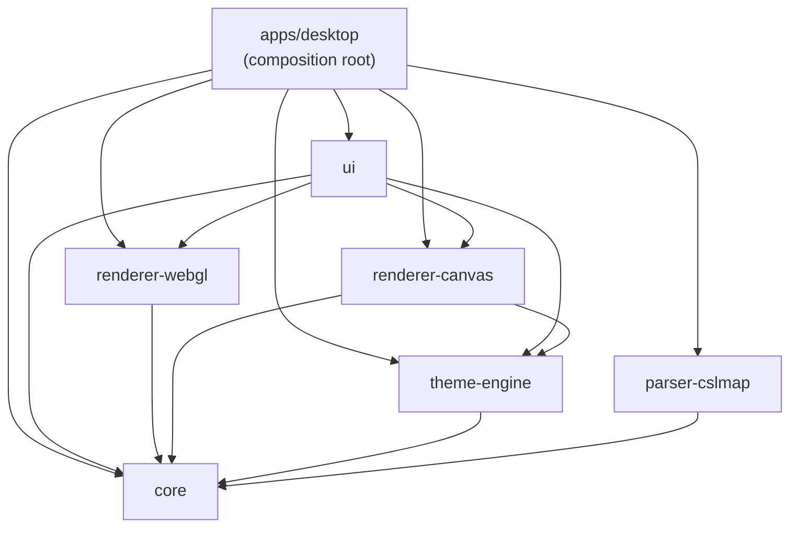

# Vellum — Integration architecture

Vellum is a pnpm + Turborepo monorepo with seven parts: `apps/desktop` as the
composition root and six `@vellum/*` packages. The package graph is intentionally
one-way and `pnpm check:architecture` enforces it through ESLint restrictions.

## Dependency graph



`@vellum/core` has no internal package dependencies. It contains the domain
entities, ports and IPC contract; it does not parse XML or draw a map.

`renderer-canvas` remains in the declared graph as a legacy implementation, but
the desktop application currently instantiates the MapLibre renderer.

## How the parts communicate

### 1. `.cslmap` to the domain: Rust through Tauri IPC

```text
.cslmap file
    │ invoke('parse_cslmap', { path })
    ▼
apps/desktop/src-tauri — delegates to packages/parser-cslmap
    │ streaming handlers for roads, buildings, transit, districts, parks, terrain
    ▼
CityData — immutable domain model shared by Rust and TypeScript
```

Unknown `ItemClass` values use the parser's width-based DLC fallback where
possible. Unrecognized assets become warnings through
`vellum://parse-warnings` rather than turning a recoverable map into a fatal
failure.

### 2. Domain to render: TypeScript without IPC

```text
CityData + RenderStyleParams
          │
          ▼
MapLibreRenderer.render()
          │
          ▼
packages/ui/src/components/canvas/MapLibreRoot.tsx
```

`IRenderer` in `packages/core` is the intended port: `render`, `updateViewport`,
`resize`, `applyTheme` and `dispose`. `renderer-webgl` implements it, while
`renderer-canvas` is retained as a legacy implementation. The current
`MapLibreRoot` still instantiates `MapLibreRenderer` directly because it also uses
MapLibre-specific capabilities such as layer subscriptions, camera controls and
snapshot capture. In other words, the port documents the desired architectural
boundary, but the active UI adapter has not been made fully renderer-agnostic yet.

### 3. Export: the stateful path

Small PNG exports can use the direct path:

```text
MapLibreRenderer.captureCanvasBytes()
  → invoke('export_png', bytes)
  → commands.rs writes the file
```

Large exports use a transactional tiled session:

```text
capability-probe.ts
  → tile-planner.ts::planTiles()
  → begin_export
  → append_export_chunk for each tile
  → finish_export → Rust tile composition → final file
```

`cancel_export` is available at every stage. SVG export reuses the cartographic
scene builders so classification and filtering rules are not independently
reimplemented for the vector path.

### 4. Themes

```text
resources/themes/*.vellumstyle
  → load_themes
  → theme-engine::loadThemes()
  → migration + validation
  → RenderStyleParams
  → MapLibreRenderer.applyTheme()
```

The five built-in themes are packaged with the desktop app. User themes are read
from the platform-specific application-data directory described in the
[`.vellumstyle` schema](vellumstyle-schema.md).

### 5. Preferences and updates

`packages/ui/src/store/preferences-store.ts` persists theme, layers, language and
automatic-update preferences through `tauri-plugin-store`. The Rust updater checks
GitHub Releases in the background, emits `vellum://update-available`, and may
download and install an update when the preference is enabled.

## IPC contract

`packages/core/src/ipc-contract.ts` is the shared source of truth.

The current command set covers parsing, theme loading, direct PNG export, export
folder opening, tiled export session lifecycle and pending-update recovery. Events
cover progress, parse warnings, update availability and opening Preferences.

When this contract changes, update the TypeScript and Rust sides in the same
commit. That is a compatibility requirement, not merely a convention.

## Shared dependencies and fixtures

- Real `.cslmap` fixtures in `packages/parser-cslmap/fixtures/` are used by Rust
  parser tests, renderer/UI tests and local development.
- `packages/core/src/testing/city-data-factory.ts` is the shared test-data helper;
  it is exposed through a separate testing barrel rather than the public API.
