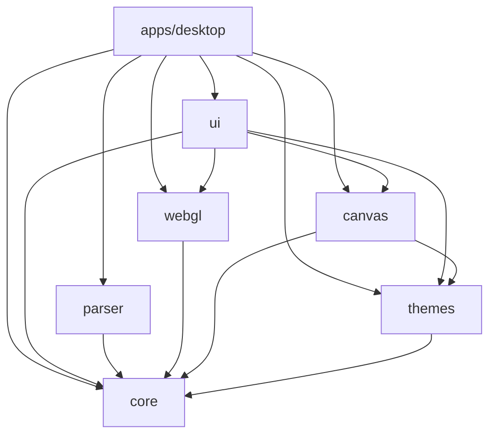
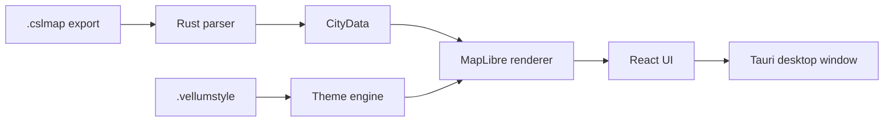

# Vellum — Project overview

Vellum is a native desktop application built with Tauri 2, React, TypeScript and
Rust. It opens `.cslmap` files exported from Cities: Skylines 1 and turns them
into interactive, GPU-accelerated maps with MapLibre GL JS.

The useful idea is simple: a city export should be something you can explore and
share as a map, not just a data file or a screenshot. The implementation is less
simple, which is why the repository separates the domain model, the parser, the
renderer and the desktop shell.

> **In simple terms:** the Rust side reads the file, the shared domain model gives
> the data a stable shape, MapLibre draws the map, and Tauri connects the native
> parts to the React interface.

## Current status

The current application version is `v0.4.0`. The core viewer workflow is
implemented: file loading, cartographic rendering, layer controls, themes,
PNG/SVG export, internationalization, preferences and background update checks.
Packaging and release automation build the desktop bundles and updater artifacts;
the future Vellum-native exporter remains a separate direction from the v1 viewer.

## Technology stack

| Category            | Technology                           | Version                          |
| ------------------- | ------------------------------------ | -------------------------------- |
| Language            | TypeScript                           | `~5.8.3`                         |
| UI framework        | React                                | `^19.1.0`                        |
| Native shell        | Tauri                                | `2.x`                            |
| Native language     | Rust                                 | Edition 2021, toolchain `1.96.0` |
| Frontend build      | Vite                                 | `^7.0.4`                         |
| Renderer            | MapLibre GL JS                       | `^5.24.0`                        |
| Package manager     | pnpm                                 | `10.33.0`                        |
| Build orchestration | Turborepo                            | `2.9.3`                          |
| State               | Zustand                              | `^5.0.12`                        |
| Styling             | Tailwind CSS 4 + Radix UI primitives | —                                |
| TypeScript tests    | Vitest                               | `^4.1.2`                         |
| End-to-end tests    | Playwright                           | `^1.59.1`                        |
| XML parser          | quick-xml                            | `0.36`                           |

## Repository structure

| Part                       | Role                                                                                        |
| -------------------------- | ------------------------------------------------------------------------------------------- |
| `apps/desktop`             | Composition root: assembles the UI, adapters and native Tauri commands.                     |
| `packages/core`            | Domain types, renderer ports and the IPC contract. It has no internal package dependencies. |
| `packages/parser-cslmap`   | Adapter that turns XML `.cslmap` data into `CityData`.                                      |
| `packages/renderer-webgl`  | Active MapLibre renderer: `CityData` becomes GeoJSON and styled map layers.                 |
| `packages/renderer-canvas` | Legacy Canvas 2D renderer, retained as a tested reference.                                  |
| `packages/theme-engine`    | Loads, validates and migrates `.vellumstyle` files.                                         |
| `packages/ui`              | React components, Zustand state, preferences and i18n.                                      |

Dependencies point inward through this graph:



`@vellum/core` remains the dependency-free domain layer. `apps/desktop` is the
composition root; packages do not reach around the graph to import one another's
implementation details.

## What the app does today

- Opens `.cslmap` files by drag and drop or `Ctrl/Cmd+O`.
- Renders terrain, water, roads, transit, buildings, forests and districts as
  independent map layers.
- Provides GPU-accelerated pan, zoom, rotation, a minimap and clean mode.
- Exports the current view as PNG at 1×, 2× or 4× scale, or as editable SVG.
- Includes five built-in themes and supports additional `.vellumstyle` files.
- Handles damaged files and unknown DLC/mod assets through controlled fallbacks
  where possible.
- Provides English and Spanish interfaces, persistent preferences and background
  update notifications.

## Data flow



The [integration architecture](integration-architecture.md) follows this flow in
detail, including the IPC boundary and the two PNG export paths.

## Quick start

```bash
git clone https://github.com/sebas-tcotd/vellum.git
cd vellum
pnpm install
pnpm dev
```

You do not need Cities: Skylines or your own save to run the development build.
Real fixtures live in [`packages/parser-cslmap/fixtures`](../../packages/parser-cslmap/fixtures).
See the [development guide](development-guide.md) for native Tauri prerequisites,
checks and tests.
