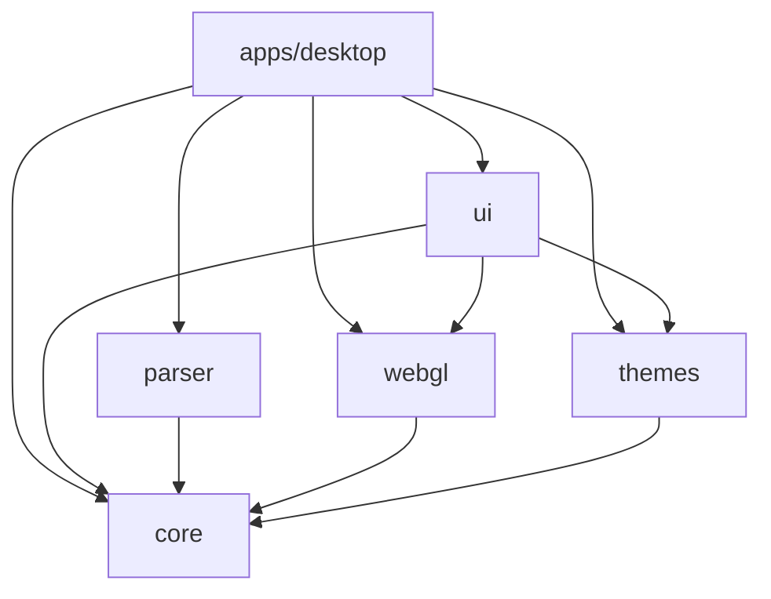
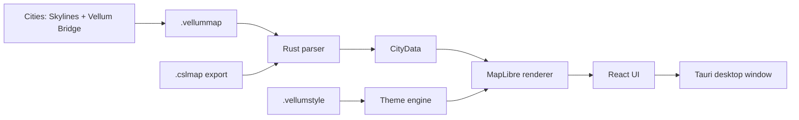

# Vellum — Project overview

Vellum is a native desktop application built with Tauri 2, React, TypeScript and
Rust. It opens cities from Cities: Skylines 1 and turns them into interactive,
GPU-accelerated maps with MapLibre GL JS. A city reaches Vellum in one of two
ways: as a `.vellummap` written in the game by the Vellum Bridge mod, or as a
`.cslmap` exported by CSL Map View.

The useful idea is simple: a city should be something you can explore and share
as a map, not just a data file or a screenshot. The implementation is less
simple, which is why the repository separates the domain model, the parsers, the
renderer and the desktop shell.

> **In simple terms:** Vellum Bridge writes the city from the game, the Rust side
> reads the file, the shared domain model gives the data a stable shape, MapLibre
> draws the map, and Tauri connects the native parts to the React interface.

## Current status

The current version is in [`VERSION`](../../VERSION) and every release is
described in the [changelog](../../CHANGELOG.md). The viewer workflow is
complete: file loading, cartographic rendering, layer controls, the transit
schematic, place inspection, themes, PNG/SVG export, internationalization,
preferences and update checks. Vellum Bridge exports `.vellummap` documents from
the game; its Steam Workshop release is the remaining step before v1.0.

## Technology stack

| Category            | Technology                             | Version                          |
| ------------------- | -------------------------------------- | -------------------------------- |
| Language            | TypeScript                             | `~5.8.3`                         |
| UI framework        | React                                  | `^19.3.0`                        |
| Native shell        | Tauri                                  | `2.x`                            |
| Native language     | Rust                                   | Edition 2021, toolchain `1.96.0` |
| Frontend build      | Vite                                   | `^7.3.6`                         |
| Renderer            | MapLibre GL JS                         | `^6.9.0`                         |
| Package manager     | pnpm                                   | `10.33.0`                        |
| Build orchestration | Turborepo                              | `2.9.14`                         |
| State               | Zustand                                | `^5.0.15`                        |
| Styling             | Tailwind CSS 4 + Radix UI primitives   | —                                |
| TypeScript tests    | Vitest                                 | `^4.1.11`                        |
| End-to-end tests    | tauri-driver + webdriverio (on Vitest) | webdriverio `^9.31.7`            |
| XML parser          | quick-xml                              | `0.41`                           |
| Game mod            | C# on .NET Framework 3.5 (CS1 Mono)    | —                                |

## Repository structure

| Part                      | Role                                                                                        |
| ------------------------- | ------------------------------------------------------------------------------------------- |
| `apps/desktop`            | Composition root: assembles the UI, adapters and native Tauri commands.                     |
| `apps/landing`            | The project website, published on GitHub Pages.                                             |
| `packages/core`           | Domain types, renderer ports and the IPC contract. It has no internal package dependencies. |
| `packages/parser-cslmap`  | Readers that turn `.cslmap` (XML) and `.vellummap` (zip) documents into `CityData`.         |
| `packages/renderer-webgl` | Active MapLibre renderer: `CityData` becomes GeoJSON and styled map layers.                 |
| `packages/theme-engine`   | Loads, validates and migrates `.vellumstyle` files.                                         |
| `packages/ui`             | React components, Zustand state, preferences and i18n.                                      |
| `tools/vellum-bridge`     | The Cities: Skylines mod that exports `.vellummap` from the game.                           |

Dependencies point inward through this graph:


```mermaid
graph TD
  desktop["apps/desktop"] --> ui
  desktop --> core
  desktop --> parser
  desktop --> webgl
  desktop --> themes
  ui --> core
  ui --> webgl
  ui --> themes
  parser --> core
  webgl --> core
  themes --> core
```

`@vellum/core` remains the dependency-free domain layer. `apps/desktop` is the
composition root; packages do not reach around the graph to import one another's
implementation details. `pnpm check:architecture` enforces it.

## What the app does today

- Opens `.vellummap` and `.cslmap` files by drag and drop or `Ctrl/Cmd+O`.
- Renders terrain, basemap (including water), roads, transit, buildings, forests
  and districts as independent map layers, each with its own options.
- Shows street names and real road widths at detail zoom.
- Draws the transit network geographically or as an octilinear schematic.
- Inspects districts, parks and buildings in a side card.
- Provides GPU-accelerated pan, zoom, rotation, a minimap, precise zoom, clean
  mode and a keyboard shortcuts sheet.
- Exports the current view as PNG at 1×, 2× or 4× scale, or as editable SVG.
- Includes five built-in themes and supports additional `.vellumstyle` files.
- Handles damaged files and unknown DLC/mod assets through controlled fallbacks
  where possible.
- Provides English and Spanish interfaces, persistent preferences and update
  notifications.

## Data flow


```mermaid
flowchart LR
  G["Cities: Skylines + Vellum Bridge"] --> V[".vellummap"]
  V --> B["Rust parser"]
  A[".cslmap export"] --> B
  B --> C["CityData"]
  C --> D["MapLibre renderer"]
  D --> E["React UI"]
  E --> F["Tauri desktop window"]
  S[".vellumstyle"] --> H["Theme engine"]
  H --> D
```

Both formats go through the same construction path into `CityData`. The
[integration architecture](integration-architecture.md) follows this flow in
detail, including the IPC boundary and the two PNG export paths. The
`.vellummap` contract is documented in
[`vellummap-format.md`](../es/vellummap-format.md) (Spanish only for now).

## Quick start

```bash
git clone https://github.com/sebas-tcotd/vellum.git
cd vellum
pnpm install
pnpm dev
```

You do not need Cities: Skylines or your own save to run the development build.
Real fixtures live in [`packages/parser-cslmap/fixtures`](../../packages/parser-cslmap/fixtures).
See the [development guide](development-guide.md) for native Tauri prerequisites,
checks and tests.
