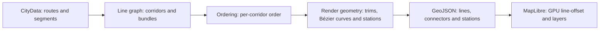

# Transit rendering pipeline

This document describes the pipeline used by Vellum's active renderer to draw
public-transit lines from a `.cslmap` file.

> **Current status (2026-08-10).** The active implementation is MapLibre/WebGL.
> This document no longer describes the old Canvas `beginPath`/`stroke` approach
> or the concentric-band renderer kept for legacy compatibility.

## In simple terms: ordering a bundle of lines

When several lines share a road, drawing them on top of one another is not enough.
The renderer must decide their transverse order, preserve that decision through a
junction, and connect every line to its actual continuation.

Vellum solves this in three pure stages:



The key separation is simple: the algorithm decides the order; MapLibre applies
the visual displacement on screen.

## Entry point

`packages/renderer-webgl/src/geojson/builders/transit.builder.ts` orchestrates the
pipeline through `buildTransitRenderData(cityData)`:

1. `buildTransitLineGraph` builds the topological representation.
2. `computeLineOrder` optimizes bundle order.
3. `buildRenderGeometry` computes trimmed corridors, connectors and stations.
4. The builder converts world-space geometry `{ x, z }` to GeoJSON through
   `csToGeoArray` —using Vellum's configured south-up CS1 orientation—and emits four
   `FeatureCollection` values:
   - `lines`: corridor centerlines with `offsetIdx`;
   - `connectors`: pre-displaced Bézier connections;
   - `stations`: stop capsules;
   - `stationDots`: overview-zoom fallback points.

World coordinates are converted to GeoJSON only at the end. The topological and
geometric calculations do not depend on MapLibre.

## 1. Building the line graph

The implementation follows the conceptual structure of the Bast, Brosi and
Storandt paper, while using an important `.cslmap` advantage: every route refers
to road segments by exact ID. Vellum does not need to reconstruct shared corridors
from noisy geographic traces.

### 1.1 Segments and line sets

`buildBaseGraph` walks `TransitLine.route[].segmentIds` and creates, for each road
segment, the set of transit lines using it. A segment referenced by a route but
missing from the parsed road network is skipped.

### 1.2 Bundles: lines that always travel together

`collapseBundles` applies Lemma 4.1: lines with exactly the same segment
membership are grouped into a **bundle**.

This matters for pairs such as CS1's `L3-CW` and `L3-CCW`. Although they are
different lines, if they traverse exactly the same segments they should not
compete for two independent visual corridors.

- A bundle retains its `lineIds`.
- Its `weight` is the number of lines it contains.
- Crossings between bundles count as `weight(A) × weight(B)` physical crossings.

### 1.3 Corridor contraction

`contractCorridors` applies the reduction corresponding to Lemma 4.2: it contracts
degree-2 chains whose two segments carry the same line set. The result is a
maximal corridor rather than a separate ordering decision for every road segment.

Pure rings are retained as self-loops in the line graph. `segmentToCorridor` maps
each original segment back to the corridor that contains it.

### 1.4 Nodes, adjacency and components

Line-graph nodes store their incident corridors ordered by counter-clockwise
azimuth. This angular order is needed when scoring crossings between different
segments.

Components are formed only from edges carrying two or more bundles. A single-
bundle corridor imposes no ordering decision and can be cut out of the optimization
problem.

### 1.5 Route-derived continuations

A corridor's line membership is not enough to determine how a line continues at a
complex node. A line can touch three or more corridors at a roundabout or revisit
the same node.

`computeTransitions` walks each line's actual segment route and records every
corridor-to-corridor transition. Both the scorer and the geometry consume this
shared index. For closed routes, the closing transition is also recorded when the
actual endpoint nodes coincide.

This removes a specific class of gaps: a line touching three corridors is no
longer discarded merely because its corridor membership is ambiguous.

## 2. Optimizing the order

`computeLineOrder` computes a bundle order for each corridor and then expands it
to individual lines for rendering.

### The MLNCM-S objective

The scorer implements the paper's node-crossing minimization objective with a line
separation penalty:

| Event                                                       | Implemented weight |
| ----------------------------------------------------------- | -----------------: |
| Crossing between lines continuing through the same corridor | `4 × degree(node)` |
| Crossing between lines taking different corridors           | `1 × degree(node)` |
| Separating a pair that was adjacent                         | `3 × degree(node)` |

Crossings are multiplied by the weights of the bundles involved. Separations are
counted once for the adjacent bundle pair.

The scorer is the objective function used by every optimizer. Search therefore does
not need to propagate mirror or orientation state manually: that normalization
lives in `seenFrom` and the line-graph geometry.

### Search strategy

- **Small components:** exhaustive enumeration when
  `∏ factorial(bundleCount) ≤ 1000`. The best order in that search space is
  guaranteed.
- **Large components:** deterministic mode-and-ID initialization, followed by
  score-driven greedy search and hill climbing.
- **Tie-break priority:** Metro, Train, Monorail, Tram, Trolleybus, CableCar,
  Ferry, Blimp, Bus and Unknown; IDs break ties within a mode.
- **Expansion:** after bundles are ordered, their lines are expanded using the
  same mode-and-ID priority.

Vellum does not embed LOOM's ILP or a WASM solver dependency. The scorer remains a
stable interface, so another solver could replace the search without changing the
line graph or renderer.

## 3. Render geometry

`buildRenderGeometry` turns the topological order into world-space geometry.

### 3.1 Trimmed corridors

Each corridor retains one centerline and its ordered line list. Before emission it
is trimmed near its junction nodes:

- `SLOT_M = 4.5 m` per transverse slot;
- line width: `3 m`;
- gap between lines: `1.5 m`;
- node padding: `2 m`;
- trimming uses the widest incident bundle;
- trimming is capped at `40%` of corridor length.

The trim leaves free space for inner connections.

### 3.2 Offsets with `line-offset`

A line at position `p` in a corridor with `n` lines receives:

```text
offsetIdx = p − (n − 1) / 2
```

The index is emitted as a GeoJSON property. `layer-transit.ts` converts it to a
MapLibre pixel offset using geographic scaling, so one index always equals
`SLOT_M` world meters. The GPU-displaced line ends therefore meet the ports of the
world-space Bézier curves.

Line width uses exponential geographic scaling at detail zooms and a `2.2 px`
floor at overview. At low zoom, offsets may visually merge into one stroke; that
is an expected degradation of geographic geometry, not a second ordering decision.

### 3.3 Inner connections

For every route transition, Vellum computes a cubic Bézier between the line's
ports on the two corridors:

- arm factor: `0.4 × distance between ports`;
- eight samples per curve;
- geometry precomputed in world space;
- `transit-connector` layer below `transit-line`;
- connectors are already displaced and therefore carry `offsetIdx = 0`.

This also works when a route visits three or more corridors at one node because
the transition comes from the real route rather than an inference from line sets.

### 3.4 Stations and stops

CS1 places stops in the middle of corridors, not necessarily at a line-graph node.
Vellum adapts the paper's station step as follows:

1. remove repeated stop IDs within a circular route;
2. group stops within `48 m`;
3. project the group onto the corridors actually serving those lines;
4. create one rounded capsule per corridor;
5. size the capsule only for the lines that stop there.

The capsule is perpendicular to the corridor, white and outlined in near-black.
If stopping lines are not contiguous in the corridor order, the marker spans from
the minimum to maximum slot and may cover an intermediate through-line. This is a
known, explicit limitation.

To keep stations visible and interactive at overview zoom, there is a second
representation:

- `transit-stops`: detail-zoom geometry capsule;
- `transit-stops-outline`: zoom-scaled outline;
- `transit-stops-dot`: overview point with a `3.4 px` minimum radius;
- cross-fade between `z15.5` and `z16.5`.

Hover queries both the capsule and the dot. Both representations carry the same
line properties, so the tooltip matches what the user sees.

## 4. MapLibre layers and export

The transit group is registered in this order:

```text
transit-connector
transit-line
transit-stops
transit-stops-outline
transit-stops-dot
```

The same `buildTransitRenderData` output is reused by the cartographic export
pipeline. Classification, ordering, connectors and stations are not reimplemented
separately for PNG/SVG.

## 5. Relationship to LOOM and justified deviations

| Paper component                   | Vellum status                                                                                       |
| --------------------------------- | --------------------------------------------------------------------------------------------------- |
| Geometric line-graph construction | Replaced by exact `.cslmap` ID grouping; the source already knows line → segment.                   |
| Lemma 4.1, bundles                | Implemented.                                                                                        |
| Lemma 4.2, corridor contraction   | Implemented.                                                                                        |
| Terminal-edge pruning/cutting     | Not needed for the current domain: CS1 lines are modeled as closed loops.                           |
| MLNCM-S and weights               | Implemented through a pure scorer.                                                                  |
| ILP                               | Replaced by bounded exhaustive search, greedy and hill climbing; LOOM's GPL code is not translated. |
| Node fronts                       | Adapted to static corridor trims, capped at `40%`.                                                  |
| Inner connections                 | Implemented as sampled cubic Bézier curves in world space.                                          |
| Stations                          | Adapted from graph nodes to mid-corridor stops.                                                     |
| Octilinear (`octi`)               | Out of scope; not part of the current renderer.                                                     |

This is a clean reimplementation based on the paper's formulas, not an integration
of the LOOM binary or a translation of its GPL-3.0 C++ code.

## 6. Legacy Canvas renderer

`@vellum/renderer-canvas` retains an independent concentric-band implementation
without this ordering pipeline. It is not mounted by the current application:
`MapLibreRoot` uses `@vellum/renderer-webgl`.

If Canvas becomes relevant again, the architectural solution is to move the pure
`line-graph`, `ordering` and `render-geometry` modules into `@vellum/core` so both
renderers share one source of truth. That work is intentionally deferred because
it would expand the scope toward an unmounted legacy renderer.

## 7. Validation and known limits

Coverage lives in:

- `packages/renderer-webgl/src/transit/line-graph.test.ts`;
- `packages/renderer-webgl/src/transit/ordering.test.ts`;
- `packages/renderer-webgl/src/transit/render-geometry.test.ts`;
- `packages/renderer-webgl/src/geojson.test.ts` for GeoJSON output.

Regression cases include the double-mirror crossing, determinism under input
permutation, CW/CCW bundles, complex nodes, closed routes, stations covering only
a subset of lines, and station cross-fade behavior.

Visual validation with real fixtures — including `aurelia-del-delta.cslmap` and
`pepper-lake.cslmap` — was necessary to find roundabout gaps, station geometry
issues and overview-zoom visibility problems. Synthetic tests do not replace that
visual review.

The current pipeline does not include octilinear routing, district boundaries or
synchronization with the legacy Canvas renderer.
