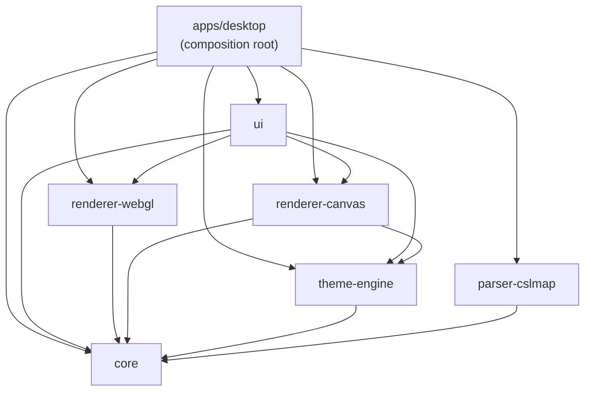

# Vellum — Arquitectura de integración

---

## Tipo de repositorio

Monorepo pnpm + Turborepo, **7 partes**: `apps/desktop` (composition root) + 6 packages `@vellum/*`. La versión anterior de este documento contaba 6 partes porque `renderer-webgl` (el renderer activo) todavía no existía — el proyecto pivotó de Canvas 2D a MapLibre GL JS después del escaneo original.

## Grafo de dependencias

Estrictamente unidireccional, enforceado en CI por `pnpm check:architecture` (regla ESLint `no-restricted-imports`):



`@vellum/core` tiene cero dependencias internas — es la capa de entidades pura. `apps/desktop` es el único Composition Root y puede importar cualquier package.

> **Nota sobre `renderer-canvas`**: sigue declarado en el grafo de paquetes como implementación legacy, pero la aplicación actual instancia el renderer MapLibre. Los wrappers React Canvas anteriores ya no forman parte del árbol activo de componentes.

## Cómo se comunican las partes

### 1. `.cslmap` → dominio (Rust vía IPC Tauri)

```
Archivo .cslmap (disco)
       │  invoke('parse_cslmap', { path })
       ▼
apps/desktop/src-tauri (Rust) — delega en el crate packages/parser-cslmap
       │  parseo streaming por handler: roads, buildings, transit, districts, parks, terrain
       ▼
CityData (packages/core — modelo de dominio inmutable, tipos espejados 1:1 en Rust y TS)
```

- Comando: `parse_cslmap` (async, corre en blocking thread para no bloquear el runtime de Tauri)
- Fallback: `ItemClass` desconocidos → `dlc_fallback::classify_by_width()`; assets no reconocidos se emiten como advertencias vía el evento `vellum://parse-warnings`, nunca como error fatal

### 2. Dominio → render (TypeScript, sin IPC)

```
CityData ──┐
           ├─→ MapLibreRenderer.render(cityData, params)  (packages/renderer-webgl, implementa IRenderer)
RenderStyleParams (theme-engine) ─┘         │
                                             ▼
                                  packages/ui/src/components/canvas/MapLibreRoot.tsx (React)
```

`IRenderer` (`packages/core/src/types/renderer.ts`) es el puerto previsto: `render`, `updateViewport`, `resize`, `applyTheme`, `dispose`. `renderer-webgl` lo implementa y `renderer-canvas` queda como implementación legacy. El `MapLibreRoot` actual todavía instancia `MapLibreRenderer` directamente porque también usa capacidades específicas de MapLibre, como suscripciones de capas, controles de cámara y captura de snapshots. Es decir, el puerto documenta el límite arquitectónico deseado, pero el adapter activo de la UI todavía no es completamente agnóstico al renderer.

### 3. Export (PNG/SVG) — el flujo más complejo del sistema

El export tiene **dos IPC distintas** según el volumen de datos:

**Export PNG de un solo tile** (mapas chicos, ruta legacy):

```
MapLibreRenderer.captureCanvasBytes() → invoke('export_png', bytes) → src-tauri/commands.rs::export_png → escribe archivo
```

**Export tiled** (mapas grandes, sesión transaccional con streaming binario):

```
capability-probe.ts (mide límites WebGL/memoria/encoder)
       │
       ▼
tile-planner.ts::planTiles() — plan determinista, puro
       │
       ▼
invoke('begin_export') → ExportSessionManager (Rust) crea sesión + archivo temporal
       │
       ▼  por cada tile: TiledRasterExporter captura → invoke('append_export_chunk')
       ▼
invoke('finish_export') → composición incremental en Rust (tile_composer.rs) → archivo final
       (invoke('cancel_export') en cualquier punto si el usuario cancela)
```

**Export SVG**: reutiliza los mismos builders de `geojson/` vía `cartographic-scene-builder.ts` para producir un `CartographicScene` (tipo de `@vellum/core`, agnóstico de renderer) que luego se serializa a SVG editable — así la lógica de clasificación/exclusión (roads, filtros de edificios) no se duplica entre el pipeline PNG y el SVG.

Comandos IPC involucrados: `export_png`, `begin_export`, `append_export_chunk`, `finish_export`, `cancel_export`, `open_export_folder`.

### 4. Temas

```
apps/desktop/src-tauri/resources/themes/*.vellumstyle (5 temas built-in)
       │  invoke('load_themes')
       ▼
theme-engine::loadThemes() — valida + migra schema (schema-migration.ts)
       │
       ▼
RenderStyleParams → MapLibreRenderer.applyTheme(style)
```

### 5. Preferencias y updates (fuera del flujo de mapa)

- **Preferencias**: `packages/ui/src/store/preferences-store.ts` lee/escribe `preferences.json` vía `tauri-plugin-store` (tema, capas, idioma, auto-update) con cola de escritura serializada
- **Updates**: `apps/desktop/src-tauri/src/updater.rs` chequea GitHub Releases en background al arrancar, emite `vellum://update-available`; si `autoUpdateEnabled` está activo, descarga/instala/reinicia solo. `get_pending_update` permite a la UI recuperar un payload que llegó antes de que el listener montara.

## Contrato IPC — inventario completo

`packages/core/src/ipc-contract.ts` es la constitución del proyecto.

**`IPC_COMMANDS`** (9): `PARSE_CSLMAP`, `LOAD_THEMES`, `EXPORT_PNG`, `OPEN_EXPORT_FOLDER`, `BEGIN_EXPORT`, `APPEND_EXPORT_CHUNK`, `FINISH_EXPORT`, `CANCEL_EXPORT`, `GET_PENDING_UPDATE`

**`IPC_EVENTS`** (4): `PROGRESS` (`vellum://progress`), `PARSE_WARNINGS`, `UPDATE_AVAILABLE`, `OPEN_PREFERENCES`

Cualquier cambio a este contrato requiere actualizar **ambos lados** (TypeScript en `packages/core` + Rust en `apps/desktop/src-tauri`) en el mismo commit — es una regla dura, no una convención.

## Dependencias compartidas entre partes

- Fixtures `.cslmap` reales (`packages/parser-cslmap/fixtures/`) se usan tanto en tests de Rust como en Vitest de `renderer-webgl`/`ui` y en la app en modo dev
- `packages/core/src/testing/city-data-factory.ts` es el único helper de test compartido (barrel separado, no forma parte del export público)
