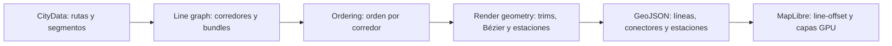

# Pipeline de renderizado de tránsito

Este documento describe el pipeline que usa el renderer activo de Vellum para
dibujar líneas de transporte público desde un archivo `.cslmap`.

> **Estado actual (2026-08-10).** La implementación activa es MapLibre/WebGL.
> Este documento ya no describe el antiguo enfoque Canvas basado en
> `beginPath`/`stroke` ni las bandas concéntricas del renderer legacy.

## En simples palabras: ordenar un haz de líneas

Cuando varias líneas comparten una calle, no basta con dibujarlas todas encima.
Hay que decidir cuál ocupa cada posición transversal, mantener esa decisión al
atravesar una junta y conectar cada línea con su continuación correcta.

Vellum resuelve el problema en tres etapas puras:



La idea clave es separar dos problemas que antes estaban mezclados: el algoritmo
decide el orden; MapLibre aplica el desplazamiento visual en pantalla.

## Punto de entrada

`packages/renderer-webgl/src/geojson/builders/transit.builder.ts` orquesta el
pipeline mediante `buildTransitRenderData(cityData)`:

1. `buildTransitLineGraph` construye la representación topológica.
2. `computeLineOrder` optimiza el orden de los bundles.
3. `buildRenderGeometry` calcula corredores recortados, conectores y estaciones.
4. El builder convierte la geometría de mundo `{ x, z }` a GeoJSON mediante
   `csToGeoArray` —con la orientación sur-arriba configurada para CS1— y emite cuatro
   `FeatureCollection`:
   - `lines`: centerlines de corredores, con `offsetIdx`;
   - `connectors`: conexiones Bézier ya desplazadas;
   - `stations`: cápsulas de paradas;
   - `stationDots`: puntos de respaldo para zoom general.

El renderer convierte las coordenadas de mundo a GeoJSON únicamente al final.
El cálculo topológico y geométrico no depende de MapLibre.

## 1. Construcción del line graph

La implementación sigue la estructura conceptual del paper de Bast, Brosi y
Storandt, pero aprovecha una ventaja de `.cslmap`: cada ruta referencia los
segmentos de carretera por ID exacto. No hace falta reconstruir corredores a
partir de trazas geográficas ruidosas.

### 1.1 Segmentos y conjuntos de líneas

`buildBaseGraph` recorre `TransitLine.route[].segmentIds` y crea, para cada
segmento de carretera, el conjunto de líneas que lo atraviesan. Los segmentos
referenciados por una ruta pero ausentes del modelo de carreteras se omiten.

### 1.2 Bundles: líneas que siempre viajan juntas

`collapseBundles` aplica el Lema 4.1: líneas con exactamente la misma membresía
de segmentos se agrupan en un **bundle**.

Esto es especialmente importante para pares como `L3-CW` y `L3-CCW` de CS1.
Aunque sean dos líneas distintas, si atraviesan exactamente los mismos segmentos
no deben competir por dos corredores visuales independientes.

- El bundle conserva sus `lineIds`.
- Su `weight` es el número de líneas que contiene.
- Los cruces entre bundles cuentan como `weight(A) × weight(B)` cruces físicos.

### 1.3 Contracción de corredores

`contractCorridors` aplica la reducción equivalente al Lema 4.2: contrae cadenas
de nodos de grado 2 cuyos dos segmentos tienen el mismo conjunto de líneas.
El resultado es un corredor máximo, no una decisión distinta por cada segmento
de carretera.

Los anillos puros se conservan como self-loops del line graph. La relación
`segmentToCorridor` permite volver desde cada segmento original a su corredor.

### 1.4 Nodos, adyacencia y componentes

Los nodos del line graph guardan sus corredores incidentes ordenados por azimut
en sentido antihorario. Ese orden angular es necesario para puntuar cruces entre
segmentos distintos.

Las componentes se forman únicamente con aristas que contienen dos o más
bundles. Un corredor de un solo bundle no impone ninguna decisión de orden y se
puede cortar del problema de optimización.

### 1.5 Continuaciones derivadas de la ruta

La pertenencia de líneas a un corredor no basta para saber cómo continúa una
línea en un nodo complejo. Una línea puede visitar tres o más corredores en una
rotonda o volver a pasar por el mismo nodo.

`computeTransitions` recorre la secuencia real de segmentos de cada ruta y
registra cada transición corredor → corredor. Tanto el scorer como la geometría
consumen ese índice compartido. Para rutas cerradas, también se registra la
transición de cierre cuando los nodos extremos reales coinciden.

Esta decisión elimina una clase concreta de huecos: una línea que toca tres
corredores ya no se descarta solo porque su conjunto de líneas sea ambiguo.

## 2. Optimización del orden

`computeLineOrder` calcula un orden de bundles para cada corredor y luego lo
expande a líneas individuales para el render.

### Objetivo MLNCM-S

El scorer implementa el objetivo de minimización de cruces de nodos del paper,
con penalización de separaciones:

| Evento                                                 |  Peso implementado |
| ------------------------------------------------------ | -----------------: |
| Cruce entre líneas que continúan por el mismo corredor | `4 × degree(node)` |
| Cruce entre líneas que toman corredores distintos      | `1 × degree(node)` |
| Separación de un par que era adyacente                 | `3 × degree(node)` |

Los cruces se multiplican por los pesos de los bundles implicados. Las
separaciones cuentan una vez por el par de bundles adyacentes.

El scorer es la función objetivo que consultan todos los optimizadores. Por eso
la búsqueda no necesita propagar manualmente espejos u orientaciones: esa
normalización vive en `seenFrom` y en la geometría del line graph.

### Estrategia de búsqueda

- **Componentes pequeñas:** enumeración exhaustiva cuando
  `∏ factorial(bundleCount) ≤ 1000`. El mejor orden de ese espacio queda
  garantizado.
- **Componentes grandes:** orden inicial determinista por prioridad de modo e ID,
  seguido de greedy dirigido por score y hill climbing.
- **Desempate:** Metro, Train, Monorail, Tram, Trolleybus, CableCar, Ferry,
  Blimp, Bus y Unknown; dentro del mismo modo se usa el ID.
- **Expansión:** después de ordenar bundles, sus líneas se expanden conservando
  la prioridad de modo e ID.

Vellum no incorpora el ILP de LOOM ni una dependencia WASM. La arquitectura deja
el scorer como interfaz estable, por lo que un solver distinto podría sustituir
la búsqueda sin modificar el line graph ni el renderer.

## 3. Geometría de render

`buildRenderGeometry` transforma el orden topológico en geometría de mundo.

### 3.1 Corredores recortados

Cada corredor conserva una sola centerline y la lista de líneas ordenadas.
Antes de emitirla se recorta cerca de sus nodos:

- `SLOT_M = 4.5 m` por posición transversal;
- ancho de línea: `3 m`;
- separación entre líneas: `1.5 m`;
- padding de nodo: `2 m`;
- el recorte usa el bundle incidente más ancho;
- el recorte queda limitado al `40 %` de la longitud del corredor.

El recorte deja libre el área donde entran las conexiones internas.

### 3.2 Offsets con `line-offset`

Una línea ubicada en la posición `p` de un corredor con `n` líneas recibe:

```text
offsetIdx = p − (n − 1) / 2
```

El índice se emite como propiedad GeoJSON. `layer-transit.ts` lo convierte en un
offset de píxeles usando la conversión geográfica de MapLibre, de modo que un
índice equivale siempre a `SLOT_M` metros de mundo. Así los extremos de las
líneas desplazadas por la GPU coinciden con los puertos de las Bézier calculadas
en mundo.

El ancho de línea usa escala geográfica exponencial en zoom de detalle y un suelo
de `2.2 px` en vista general. Los offsets pueden fundirse visualmente en un solo
trazo a zoom bajo; es una degradación esperada de una geometría geográfica, no
una segunda decisión de orden.

### 3.3 Conexiones internas

Por cada transición de ruta se calcula una Bézier cúbica entre los puertos de la
línea en los dos corredores:

- factor de brazo: `0.4 × distancia entre puertos`;
- ocho muestras por curva;
- geometría precalculada en espacio de mundo;
- capa `transit-connector` debajo de `transit-line`;
- los conectores ya están desplazados y por eso llevan `offsetIdx = 0`.

El resultado funciona también cuando una ruta pasa por tres o más corredores en
el mismo nodo, porque la transición viene de la trayectoria real y no de una
inferencia por conjunto de líneas.

### 3.4 Estaciones y paradas

CS1 coloca las paradas a mitad de corredor, no necesariamente en un nodo del
line graph. Vellum adapta el paso de estaciones del paper así:

1. elimina repeticiones del mismo stop dentro de una ruta circular;
2. agrupa stops a una distancia de hasta `48 m`;
3. proyecta el grupo sobre los corredores que realmente sirven esas líneas;
4. crea una cápsula redondeada por corredor;
5. dimensiona la cápsula solo para las líneas que paran allí.

La cápsula es perpendicular al corredor, blanca y con borde casi negro. Si las
líneas que paran no son contiguas en el orden del corredor, cubre desde el slot
mínimo al máximo; puede abarcar una línea intermedia que solo pasa, una limitación
conocida y explícita.

Para que las paradas sigan siendo visibles e interactivas a zoom de ciudad,
existe una segunda representación:

- `transit-stops`: cápsula geométrica para zoom de detalle;
- `transit-stops-outline`: borde escalado por zoom;
- `transit-stops-dot`: punto con radio mínimo de `3.4 px` para zoom general;
- cross-fade entre `z15.5` y `z16.5`.

El hover consulta tanto la cápsula como el punto. Ambas representaciones llevan
las mismas líneas en sus propiedades, de modo que el tooltip coincide con lo que
el usuario ve.

## 4. Capas MapLibre y export

El grupo de tránsito se registra en este orden:

```text
transit-connector
transit-line
transit-stops
transit-stops-outline
transit-stops-dot
```

La misma salida `buildTransitRenderData` se reutiliza en el pipeline de export
cartográfico. La lógica de clasificación, orden, conectores y estaciones no se
duplica para PNG/SVG.

## 5. Relación con LOOM y desviaciones justificadas

| Parte del paper                        | Estado en Vellum                                                                                |
| -------------------------------------- | ----------------------------------------------------------------------------------------------- |
| Construcción geométrica del line graph | Sustituida por agrupación exacta por IDs de `.cslmap`; la fuente ya conoce línea → segmento.    |
| Lema 4.1, bundles                      | Implementado.                                                                                   |
| Lema 4.2, contracción de corredores    | Implementado.                                                                                   |
| Pruning/cutting de aristas terminales  | No necesario para el dominio actual: las líneas CS1 se modelan como bucles cerrados.            |
| MLNCM-S y pesos                        | Implementado mediante scorer puro.                                                              |
| ILP                                    | Sustituido por exhaustivo acotado, greedy y hill climbing; no se traduce el código GPL de LOOM. |
| Node fronts                            | Adaptados a trims estáticos por corredor, con tope del 40 %.                                    |
| Inner connections                      | Implementadas como Bézier cúbicas muestreadas en mundo.                                         |
| Estaciones                             | Adaptadas de nodos del grafo a paradas de mitad de corredor.                                    |
| Octilinear (`octi`)                    | Fuera de alcance; no forma parte del renderer actual.                                           |

La implementación es una reimplementación basada en las fórmulas del paper,
no una integración del binario LOOM ni una traducción del código C++ GPL-3.0.

## 6. Renderer Canvas legacy

`@vellum/renderer-canvas` conserva una implementación independiente de bandas
concéntricas sin este ordering. No es el renderer montado por la aplicación
actual: `MapLibreRoot` usa `@vellum/renderer-webgl`.

Si Canvas volviera a ser relevante, la solución arquitectónica sería mover los
módulos puros `line-graph`, `ordering` y `render-geometry` a `@vellum/core` para
que ambos renderers compartieran una única fuente de verdad. No se hace ahora
porque ampliaría el alcance hacia un renderer legacy no montado.

## 7. Validación y límites conocidos

La implementación tiene cobertura en:

- `packages/renderer-webgl/src/transit/line-graph.test.ts`;
- `packages/renderer-webgl/src/transit/ordering.test.ts`;
- `packages/renderer-webgl/src/transit/render-geometry.test.ts`;
- `packages/renderer-webgl/src/geojson.test.ts` para la salida GeoJSON.

Los casos de regresión incluyen el cruce por doble espejo, determinismo bajo
permutación de entrada, bundles CW/CCW, nodos complejos, rutas cerradas,
estaciones que cubren solo un subconjunto de líneas y el cross-fade de paradas.

La validación visual con fixtures reales —incluidos `aurelia-del-delta.cslmap` y
`pepper-lake.cslmap`— fue necesaria para detectar huecos en rotondas, geometría
de estaciones y visibilidad a zoom bajo. Los tests sintéticos no sustituyen esa
revisión visual.

Quedan fuera de este pipeline: routing octilinear, límites geográficos de
distritos y sincronización del renderer Canvas legacy.
