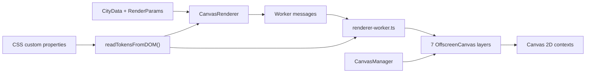

# `@vellum/renderer-canvas`

The original Canvas 2D renderer for Vellum.

> **Legacy package — discontinued for active application development**
>
> The desktop application uses [`@vellum/renderer-webgl`](../renderer-webgl), powered by MapLibre GL JS. This package remains in the repository as a public, tested reference for the rendering work that preceded the WebGL migration. It is not part of the active rendering path and should not be extended for new product features.

## What this package was

`@vellum/renderer-canvas` adapted immutable `CityData` from `@vellum/core` into a layered, interactive map drawn with the browser's Canvas 2D API. It implemented the shared `IRenderer` port, which allowed the UI and domain model to remain independent from the concrete rendering engine.

The design was deliberately close to the map's domain model: terrain, water, roads, transit, buildings, forests and districts were rendered as separate layers. That made layer visibility straightforward and kept the renderer replaceable, but it also meant that a full map could require several large canvases to be painted and kept in sync.

## Architecture at the point of retirement



### Main pieces

- **`CanvasRenderer`** implements `IRenderer`. It creates the worker lazily, registers transferred canvases, sends render and viewport messages, buffers a render until all layers are registered, and resolves render promises when the worker reports completion.
- **`CanvasManager`** creates one positioned `<canvas>` per layer, transfers each element to an `OffscreenCanvas`, controls CSS opacity for layer visibility, and owns DOM cleanup.
- **`renderer-worker.ts`** owns the `OffscreenCanvasRenderingContext2D` instances. It receives `init-layer`, `render`, `resize` and `update-viewport` messages, projects the map, clears each buffer and invokes the corresponding layer renderer.
- **`worker/messages.ts`** defines the small message protocol between the main thread and the worker.
- **`tokens.ts`** reads renderer colors from CSS custom properties once at renderer construction. When CSS variables are unavailable, it uses built-in fallback colors.
- **`overscan.ts`** defines the `1.5` render-buffer factor and the derived per-side margin used to make panning reveal already-painted pixels.
- **`geometry/`** contains supporting geometry utilities such as presence grids and water contours.
- **`layers/`** contains one renderer per map layer. Each layer receives a Canvas 2D context, domain data, map bounds, tokens, fit dimensions, zoom and pan.

The package's layer stack is:

| Layer       | Responsibility                                                                                         |
| ----------- | ------------------------------------------------------------------------------------------------------ |
| `terrain`   | Terrain base/ramp rendering; currently a no-op in the worker because the old tile inputs were removed. |
| `basemap`   | Water/base fill; currently a no-op in the worker for the same historical reason.                       |
| `roads`     | Road geometry, casings, tiers, dash patterns and item-class filtering.                                 |
| `transit`   | Transit routes, merged stops and mode markers.                                                         |
| `buildings` | Building footprints with fill and stroke styling.                                                      |
| `forests`   | Forest-density texture generation and filtered compositing.                                            |
| `districts` | District fills and labels, including the DM Mono worker font.                                          |

The package is intentionally separate from React. The UI owns the viewport and DOM container; this package owns canvas setup, worker communication and painting. It depends on `@vellum/core` and `@vellum/theme-engine`, and does not depend on the active WebGL renderer.

## The overscan approach

To make panning feel immediate, the worker paints a buffer larger than the visible viewport. With the current factor:

```text
buffer = round(viewport × 1.5)
margin = (buffer − viewport) / 2
```

The map is projected using the viewport-sized fit dimensions and shifted into the larger buffer. As the user pans, the already-painted margin is exposed before another render is needed. The tradeoff is fundamental: seven physical canvases make the memory and paint cost grow with the square of the buffer size, and zooming out increases the amount of geometry that must be painted.

## Why it was discontinued

The Canvas renderer reached a technical ceiling rather than a missing-feature ceiling. CPU-side painting combined with a multi-layer overscan buffer did not scale well for the target experience, especially as zooming and map extent increased. The buffer improved short-distance panning, but it multiplied the amount of canvas memory and work involved in every render.

The project therefore moved to MapLibre GL JS and WebGL. The active renderer delegates geometry and large-scale map composition to a GPU-oriented engine while preserving the same higher-level separation between `CityData`, rendering and UI. `CanvasRenderer.applyTheme()` is consequently a no-op: the legacy implementation reads its CSS-derived tokens at construction and does not participate in the current live theme contract.

## Status and intended use

This package is:

- **legacy** — retained for historical and architectural context;
- **discontinued** — no longer the renderer mounted by the desktop application;
- **publicly readable** — useful to anyone studying the first rendering approach;
- **open to revival** — someone may be able to solve the scaling problem or find a way around the technical ceiling identified during development.

That last possibility is deliberate. The package is not presented as a supported alternative today, but it remains available in the tree so a future contributor can experiment with a better Canvas strategy, a different tiling model, selective rasterization, or another way to make the tradeoffs acceptable.

## Tests and exploration

The package includes unit tests for the renderer, canvas manager, overscan behavior, geometry helpers and individual layers. Run its focused checks from the repository root:

```bash
pnpm --filter @vellum/renderer-canvas lint
pnpm --filter @vellum/renderer-canvas test
```

When investigating visual behavior, use a real `.cslmap` fixture through the application. Synthetic unit fixtures are useful for logic, but they cannot fully expose the performance and compositing behavior that led to the migration.

## Relationship to the active renderer

For current rendering work, start with [`@vellum/renderer-webgl`](../renderer-webgl) and the MapLibre integration in the UI. Keep this package as a reference unless the goal is specifically to research or revive the Canvas approach.
